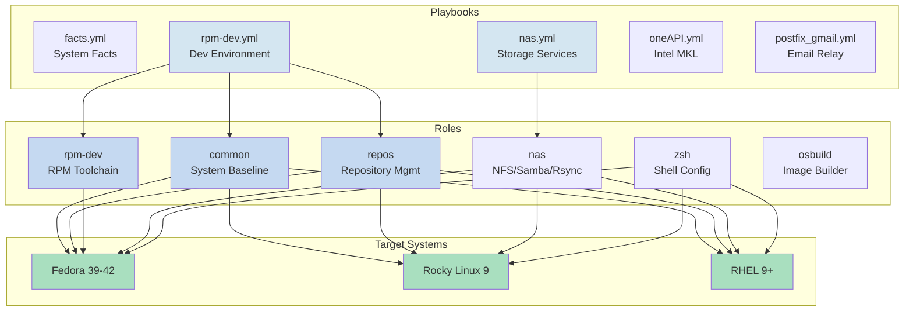
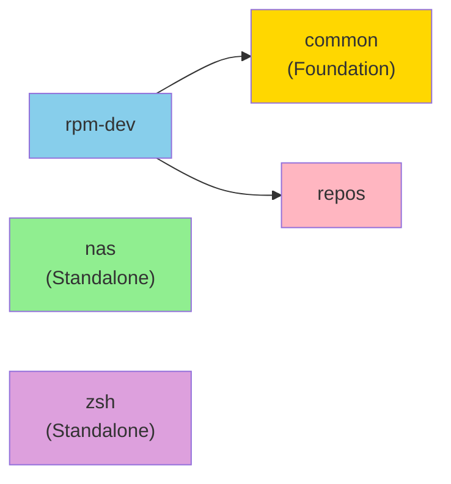

# Ansible Workstation Provisioning

A comprehensive, modular Ansible framework for automated workstation provisioning and system configuration on RHEL-family systems (Fedora, Rocky Linux 9, RHEL 9+). This project provides production-ready roles and playbooks for setting up development environments, network storage, shell configurations, and specialized toolchains.

[](https://docs.ansible.com/)
[](https://www.redhat.com/)
[](LICENSE)

## Overview

This project provides a complete automation framework for workstation provisioning on RHEL-family systems. Built with modularity and flexibility as core principles, it enables reproducible system configurations through role-based playbooks that can be composed to meet diverse user needs.

### Target Platforms

- **Fedora**: 39, 40, 41, 42
- **Rocky Linux**: 9.x
- **RHEL**: 9.x

### Key Capabilities

- **Modular Role Architecture**: Six specialized roles enabling selective feature deployment
- **Development Environment Setup**: Complete RPM development environment with Mock build system
- **Network Storage Configuration**: Multi-protocol NAS services (NFS, Samba/SMB, Rsync)
- **Shell Environment**: Comprehensive Zsh configuration with Oh My Zsh and plugins
- **System Baseline**: Base system configuration with GRUB, timezone, and locale management
- **Repository Management**: Optimized DNF configuration and repository setup
- **Extensible Framework**: Custom Ansible plugins and distribution-specific variable management

## Quick Start

### Prerequisites

- **Ansible**: 2.9 or higher
- **Python**: 3.6 or higher on target systems
- **SSH Access**: To target systems (or localhost for local execution)
- **Sudo Privileges**: Required for system configuration tasks

### Installation

Clone the repository:

```bash
git clone <repository-url>
cd /home/b08x/WorkspaceV2/RHEL/ansible
```

Install dependencies:

```bash
# Install required Ansible collections
ansible-galaxy collection install ansible.posix
```

### Basic Execution

Run the complete workstation provisioning playbook:

```bash
# Local execution (to localhost)
ansible-playbook playbooks/rpm-dev.yml

# With verbose output for debugging
ansible-playbook playbooks/rpm-dev.yml -vvv

# Syntax check before execution
ansible-playbook playbooks/rpm-dev.yml --syntax-check

# Dry run (check mode)
ansible-playbook playbooks/rpm-dev.yml --check --diff
```

Run specific playbooks:

```bash
# System facts gathering
ansible-playbook playbooks/facts.yml

# Network storage configuration
ansible-playbook playbooks/nas.yml

# RPM development environment
ansible-playbook playbooks/rpm-dev.yml

# Intel oneAPI MKL installation
ansible-playbook playbooks/oneAPI.yml

# Postfix Gmail relay setup
ansible-playbook playbooks/postfix_gmail.yml --ask-vault-pass
```

## Project Structure

```
ansible/
├── playbooks/                      # Main playbook definitions
│   ├── facts.yml                  # Base system facts gathering
│   ├── rpm-dev.yml                # RPM development environment
│   ├── nas.yml                    # Network storage services
│   ├── oneAPI.yml                 # Intel oneAPI MKL installation
│   └── postfix_gmail.yml          # Postfix Gmail relay configuration
│
├── roles/                          # Ansible roles (modular components)
│   ├── common/                    # System baseline configuration
│   ├── repos/                     # Repository management and DNF optimization
│   ├── rpm-dev/                   # Complete RPM development environment
│   ├── nas/                       # Network storage (NFS, Samba, Rsync)
│   ├── zsh/                       # Zsh shell environment
│   └── osbuild/                   # OSBuild integration (placeholder)
│
├── inventory/                      # Inventory definitions
│   └── inventory.ini              # Host and group definitions
│
├── vars/                           # Global variables
│   ├── secrets.yml                # Encrypted secrets (Ansible Vault)
│   └── *.yml                      # Distribution-specific variables
│
├── plugins/                        # Custom Ansible plugins
│   ├── modules/                   # Custom modules
│   ├── filter/                    # Custom filters
│   └── callback/                  # Custom callbacks
│
├── ansible.cfg                     # Ansible configuration
├── inventory.ini                   # Default inventory
├── .ansible-lint                  # ansible-lint configuration
├── .yamllint.yaml                 # YAML linting rules
└── README.md                       # This file
```

### Configuration Files

**ansible.cfg**: Defines project-wide Ansible settings including:
- Custom plugin paths (modules, filters, callbacks)
- Fact caching (via jsonfile)
- SSH connection optimization
- Default inventory path
- Logging configuration

**inventory.ini**: Default inventory with localhost configured for local execution:
```ini
[localhost]
localhost ansible_connection=local
```

**Distribution-Specific Variables**: Located in `roles/*/vars/`:
- Fedora: Fedora-specific package lists and configurations
- RedHat: RHEL/Rocky Linux-specific settings

## Available Playbooks

| Playbook | Purpose | Roles Used | Notes |
|----------|---------|-----------|-------|
| **facts.yml** | Gather system facts and base configuration | - | Debug playbook for system introspection |
| **rpm-dev.yml** | Configure RPM development environment | common, repos, rpm-dev | Fedora 42 focus with Mock support |
| **nas.yml** | Configure network-attached storage services | - | Manually configurable for NFS/Samba/Rsync |
| **oneAPI.yml** | Install Intel oneAPI MKL toolkit | - | Adds Intel repository and scientific computing libraries |
| **postfix_gmail.yml** | Configure Postfix to relay via Gmail SMTP | - | Requires encrypted secrets.yml with Gmail credentials |

## Roles Overview

### 1. Common Role
**Purpose**: System baseline configuration and fundamental setup

**Features**:
- GRUB bootloader configuration
- System timezone management
- Locale configuration
- Optional system rc.local setup
- YADM dotfile management integration

**Usage**:
```yaml
- hosts: workstations
  become: true
  roles:
    - common
```

**Reference**: See `/home/b08x/WorkspaceV2/RHEL/ansible/roles/common/README.md`

---

### 2. Repos Role
**Purpose**: Repository management and DNF optimization

**Features**:
- Fedora and RHEL-specific repository configuration
- DNF package manager optimization
- Repository enable/disable management
- Custom repository setup

**Usage**:
```yaml
- hosts: workstations
  become: true
  roles:
    - repos
```

---

### 3. RPM-Dev Role
**Purpose**: Complete RPM package development environment

**Features**:
- Full RPM toolchain installation (mock, rpm-build, rpmdevtools, rpmlint)
- Mock build system configuration for clean builds
- User environment setup with mock group membership
- RPM build directory structure creation
- Fedora packaging tools (fedpkg, spectool)

**Installed Tools**:
- Core tools: `mock`, `rpm-build`, `rpmdevtools`, `rpmlint`
- Fedora packaging: `fedpkg`, `fedora-packager`, `spectool`
- Development: `@development-tools`, `git`, `patch`
- Utilities: `createrepo_c`, `koji`, `rpm-sign`

**Usage**:
```yaml
- hosts: workstations
  become: true
  roles:
    - rpm-dev
```

**Build Example**:
```bash
# Initialize mock environment
mock -r fedora-42-x86_64 --init

# Build RPM from SRPM
mock -r fedora-42-x86_64 package.src.rpm
```

**Reference**: See `/home/b08x/WorkspaceV2/RHEL/ansible/roles/rpm-dev/README.md`

---

### 4. NAS Role
**Purpose**: Network-attached storage configuration (NFS, Samba, Rsync)

**Features**:
- NFSv4 server configuration with exports management
- Samba/SMB protocol support with share configuration
- Rsync daemon setup for backup operations
- Firewall integration (firewalld)
- Comprehensive ACL and permission management

**Services Configurable**:
- NFSv4 exports with client access control
- Samba shares with user authentication
- Rsync modules with read-only/read-write modes

**Usage - NFS Only**:
```yaml
- hosts: nas_server
  become: true
  roles:
    - role: nas
      vars:
        nas_enable_nfs: true
        nas_enable_samba: false
        nas_enable_rsync: false
        nas_nfs_exports:
          - path: /srv/nfs
            create_dir: true
            is_root: true
```

**Usage - Full NAS Stack**:
```yaml
- hosts: nas_server
  become: true
  roles:
    - role: nas
      vars:
        nas_enable_nfs: true
        nas_enable_samba: true
        nas_enable_rsync: true
```

**Reference**: See `/home/b08x/WorkspaceV2/RHEL/ansible/roles/nas/README.md`

---

### 5. Zsh Role
**Purpose**: Comprehensive Zsh shell environment configuration

**Features**:
- Oh My Zsh installation and configuration
- Zoxide smart directory navigation
- Custom shell functions and aliases
- Multi-user deployment (user and root)
- X11 auto-start for window managers
- Distribution-specific package management

**Installed Components**:
- Zsh shell with plugins
- Oh My Zsh framework
- Zoxide (optional)
- Custom functions: docker, systemd, git helpers
- Custom plugins: fd, ripgrep

**Usage**:
```yaml
- hosts: workstations
  become: true
  vars:
    user:
      name: jdoe
      group: jdoe
      home: /home/jdoe
    zsh_theme: "robbyrussell"
    desktop: "sway"
  roles:
    - zsh
```

**Reference**: See `/home/b08x/WorkspaceV2/RHEL/ansible/roles/zsh/README.md`

---

### 6. OSBuild Role
**Purpose**: OSBuild image builder integration (currently a placeholder)

**Status**: Framework in place for OSBuild integration

---

## Configuration Management

### Ansible Configuration (ansible.cfg)

Key settings for this project:

```ini
[defaults]
inventory = ./inventory/inventory.ini
roles_path = ./roles:./.ansible/roles
fact_caching = jsonfile
fact_caching_connection = /tmp/ansible_cache
fact_caching_timeout = 86400

[privilege_escalation]
become_method = sudo
become_ask_pass = False
```

### Inventory Setup

The default inventory (`inventory.ini`) contains:

```ini
[localhost]
localhost ansible_connection=local
```

To use with remote hosts:

```ini
[workstations]
workstation1.example.com
workstation2.example.com

[nas_servers]
nas.example.com

[all:vars]
ansible_user = youruser
ansible_become_password = your_sudo_password
```

### Variable Precedence

Ansible loads variables in this order (highest to lowest precedence):

1. Extra variables (`-e` flag)
2. Task variables
3. Block variables
4. Play variables
5. Host variables (host_vars/)
6. Group variables (group_vars/)
7. Role defaults (roles/*/defaults/main.yml)

### Distribution-Specific Variables

Roles automatically load distribution-specific variables:

```yaml
# In roles/*/vars/Fedora.yml
packages__zsh:
  - zsh
  - zsh-syntax-highlighting
  - zsh-completions

# In roles/*/vars/RedHat.yml
packages__zsh:
  - zsh
  - zsh-syntax-highlighting
```

## Usage Examples

### Example 1: Complete RPM Developer Workstation

```bash
# Run the dedicated playbook
ansible-playbook playbooks/rpm-dev.yml

# Or manually compose
ansible-playbook -i inventory.ini \
  --tags "rpm-dev" \
  playbooks/rpm-dev.yml
```

### Example 2: Developer Environment with Zsh and Storage

```yaml
---
- name: Setup Developer Workstation
  hosts: localhost
  become: true
  gather_facts: true

  roles:
    - role: common
    - role: repos
    - role: zsh
      vars:
        user:
          name: "{{ ansible_user_id }}"
          group: "{{ ansible_user_id }}"
          home: "{{ ansible_user_dir }}"
        zsh_theme: "agnoster"
        desktop: "sway"
    - role: rpm-dev
```

### Example 3: Network Storage Server

```bash
# Configure NFS and Samba exports
ansible-playbook playbooks/nas.yml \
  -e "nas_enable_nfs=true" \
  -e "nas_enable_samba=true" \
  -e "nas_enable_rsync=false"
```

### Example 4: Selective Role Deployment

```bash
# Deploy only packages (skip other tasks)
ansible-playbook playbooks/rpm-dev.yml --tags "packages"

# Skip zoxide installation
ansible-playbook playbooks/zsh-config.yml --skip-tags "zoxide"

# Deploy configuration only
ansible-playbook playbooks/rpm-dev.yml --tags "config"
```

### Example 5: Local Development with Check Mode

```bash
# Preview what would change (dry run)
ansible-playbook playbooks/rpm-dev.yml --check --diff

# Show detailed execution
ansible-playbook playbooks/rpm-dev.yml --check --diff -vvv
```

## Security Considerations

### Vault-Protected Secrets

The `vars/secrets.yml` file contains sensitive credentials and is encrypted using Ansible Vault:

**Encrypting secrets**:
```bash
ansible-vault create vars/secrets.yml
```

**Editing encrypted secrets**:
```bash
ansible-vault edit vars/secrets.yml
```

**Running playbooks that require vault**:
```bash
# Interactive password prompt
ansible-playbook playbooks/postfix_gmail.yml --ask-vault-pass

# Using vault password file
ansible-playbook playbooks/postfix_gmail.yml --vault-password-file ~/.vault_pass
```

### NAS Role Security Warnings

The NAS role exposes network services with significant security implications:

- **NFS**: Accessible to configured networks; restrictive firewall rules recommended
- **Samba/SMB**: Network file sharing; use strong authentication
- **Rsync**: Remote synchronization; verify host access controls

**Security best practices**:
- Restrict NAS to private networks only
- Use firewalld rules to limit access
- Implement strong user authentication
- Monitor network traffic for NAS services
- Keep systems patched and updated

### Recommended Firewall Configuration

```bash
# Allow NFS only from trusted networks
sudo firewall-cmd --permanent --zone=trusted --add-service=nfs
sudo firewall-cmd --permanent --zone=trusted --add-service=mountd
sudo firewall-cmd --permanent --zone=trusted --add-service=rpc-bind

# Allow Samba only from trusted networks
sudo firewall-cmd --permanent --zone=trusted --add-service=samba

# Reload firewall
sudo firewall-cmd --reload
```

## Deployment Architecture



## Role Dependency Graph



## Troubleshooting Guide

### Syntax Validation

```bash
# Check playbook syntax
ansible-playbook playbooks/rpm-dev.yml --syntax-check

# Lint roles
ansible-lint roles/rpm-dev/
```

### Debug Mode

Enable verbose output:

```bash
# Single verbose level (more info)
ansible-playbook playbooks/rpm-dev.yml -v

# Triple verbose (maximum debugging)
ansible-playbook playbooks/rpm-dev.yml -vvv

# Show variable values
ansible-playbook playbooks/rpm-dev.yml -e "ansible_verbosity=4"
```

### Common Issues

**Issue**: Task fails with "permission denied"
```bash
# Solution: Verify sudo privileges
ansible-playbook playbooks/rpm-dev.yml -b -K
```

**Issue**: Module not found or missing dependency
```bash
# Solution: Verify Ansible version and collections
ansible --version
ansible-galaxy collection list
```

**Issue**: Host facts not available
```bash
# Solution: Ensure fact gathering is enabled
# In playbook: gather_facts: true
```

**Issue**: Vault password prompts for every task
```bash
# Solution: Use vault password file instead
echo "your-password" > ~/.vault_pass
chmod 600 ~/.vault_pass
ansible-playbook playbooks/postfix_gmail.yml \
  --vault-password-file ~/.vault_pass
```

### Viewing Logs

Logs are written to `/tmp/ansible.log`:

```bash
# Follow logs in real time
tail -f /tmp/ansible.log

# View last 50 lines
tail -50 /tmp/ansible.log

# Search for errors
grep ERROR /tmp/ansible.log
```

## Documentation References

For detailed information, see the following documentation files:

- **[VARIABLES.md](docs/VARIABLES.md)** - Comprehensive variable reference guide
- **[PLAYBOOKS.md](docs/PLAYBOOKS.md)** - Detailed playbook documentation
- **[EXAMPLES.md](docs/EXAMPLES.md)** - Real-world usage examples
- **[rpm-dev README](roles/rpm-dev/README.md)** - RPM development role documentation
- **[nas README](roles/nas/README.md)** - Network storage role documentation
- **[zsh README](roles/zsh/README.md)** - Zsh shell role documentation
- **[common README](roles/common/README.md)** - System baseline role documentation

## Development and Contributing

### Code Organization

The project follows Ansible best practices:

```
roles/ROLENAME/
├── defaults/main.yml          # Default variables (lowest precedence)
├── vars/                       # Distribution-specific variables
│   ├── Fedora.yml
│   └── RedHat.yml
├── tasks/main.yml             # Task orchestration
├── handlers/main.yml          # Service handlers
├── templates/                 # Jinja2 templates
├── files/                      # Static files
├── meta/main.yml              # Role metadata
├── tests/test.yml             # Role tests
└── README.md                   # Role documentation
```

### Linting and Validation

```bash
# Install linting tools
pip install ansible-lint yamllint

# Run ansible-lint on entire project
ansible-lint

# Run ansible-lint on specific role
ansible-lint roles/rpm-dev/

# Check YAML syntax
yamllint -c .yamllint.yaml .
```

### Contributing Guidelines

1. **Test your changes**: Use `--check --diff` mode
2. **Validate syntax**: Run `ansible-lint` and `ansible-playbook --syntax-check`
3. **Update documentation**: Reflect changes in role READMEs
4. **Follow conventions**: Match existing code style
5. **Test on multiple distributions**: Verify Fedora and Rocky Linux compatibility

## License

This project is licensed under the **MIT-0 License** (MIT without attribution requirement).

See [LICENSE](LICENSE) for details.

## Author Information

**Created by**: b08x
**Project Focus**: RHEL-family workstation automation for development and system administration

## Support and Community

For questions, issues, or contributions:

- Check the troubleshooting section above
- Review role-specific README files
- Examine playbook examples
- Consult Ansible documentation: https://docs.ansible.com/

---

## Quick Command Reference

```bash
# Clone and setup
git clone <repo-url>
cd ansible
ansible-galaxy collection install ansible.posix

# Run playbooks
ansible-playbook playbooks/facts.yml              # System facts
ansible-playbook playbooks/rpm-dev.yml           # Dev environment
ansible-playbook playbooks/nas.yml               # Network storage
ansible-playbook playbooks/oneAPI.yml            # Intel MKL
ansible-playbook playbooks/postfix_gmail.yml --ask-vault-pass

# Validation
ansible-playbook playbooks/rpm-dev.yml --syntax-check
ansible-playbook playbooks/rpm-dev.yml --check --diff
ansible-lint

# Debugging
ansible-playbook playbooks/rpm-dev.yml -vvv
tail -f /tmp/ansible.log
```

---

**Last Updated**: December 2024
**Ansible Version**: 2.9+
**Python Version**: 3.6+
