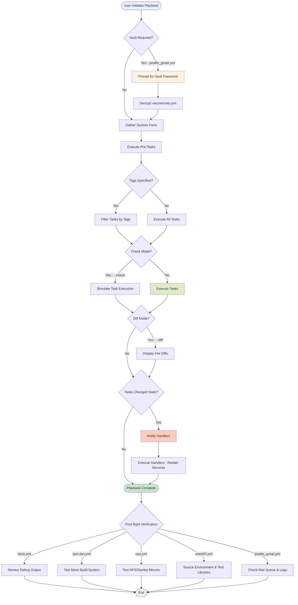

# Playbook Documentation

## Table of Contents

- [Introduction](#introduction)
- [Playbook Overview](#playbook-overview)
- [General Playbook Execution](#general-playbook-execution)
- [Individual Playbook Documentation](#individual-playbook-documentation)
  - [facts.yml - Base Environment Discovery](#factsyml---base-environment-discovery)
  - [rpm-dev.yml - RPM Development Environment](#rpm-devyml---rpm-development-environment)
  - [nas.yml - Network Storage Services](#nasyml---network-storage-services)
  - [oneAPI.yml - Intel Math Kernel Library](#oneapiyml---intel-math-kernel-library)
  - [postfix_gmail.yml - Email Relay Configuration](#postfix_gmailyml---email-relay-configuration)
- [Playbook Dependencies and Execution Order](#playbook-dependencies-and-execution-order)
- [Tag-Based Execution](#tag-based-execution)
- [Troubleshooting by Playbook](#troubleshooting-by-playbook)
- [Execution Flow Diagram](#execution-flow-diagram)
- [Best Practices](#best-practices)
- [Cross-References](#cross-references)

---

## Introduction

### Purpose of this Document

This document provides comprehensive, operational guidance for executing and managing the five core playbooks in this Ansible automation framework. Each playbook **transforms** target systems through Material Processes (installation, configuration, service management) and is designed to support DevOps engineers and system administrators provisioning RHEL-family workstations.

### How to Use This Documentation

- **Quick Reference**: Use the [Playbook Overview Table](#playbook-overview) to identify which playbook addresses your needs
- **Execution Guidance**: Each playbook section provides step-by-step execution examples with required variables
- **Troubleshooting**: Consult the [Troubleshooting](#troubleshooting-by-playbook) section for common failure scenarios
- **Advanced Usage**: See [Tag-Based Execution](#tag-based-execution) for selective task execution

### Navigation

Click any playbook name to jump to its detailed documentation:
- [facts.yml](#factsyml---base-environment-discovery) - System discovery and environment validation
- [rpm-dev.yml](#rpm-devyml---rpm-development-environment) - Complete RPM packaging setup
- [nas.yml](#nasyml---network-storage-services) - Multi-protocol network storage (NFS/Samba/Rsync)
- [oneAPI.yml](#oneapiyml---intel-math-kernel-library) - Intel oneAPI Math Kernel Library installation
- [postfix_gmail.yml](#postfix_gmailyml---email-relay-configuration) - Gmail SMTP relay configuration

---

## Playbook Overview

| Playbook | Purpose | Roles Used | Variables Required | Vault Required | Typical Duration |
|----------|---------|------------|-------------------|----------------|------------------|
| `facts.yml` | System fact gathering and environment validation | None (pre-tasks only) | `path` (optional) | No | < 30 seconds |
| `rpm-dev.yml` | RPM development environment setup with Mock | `rpm-dev` | `rpm_dev_user`, `rpm_build` | No | 5-10 minutes |
| `nas.yml` | Network storage services (NFS/Samba/Rsync) | `nas` | `nas_nfs_exports`, `nas_enable_*` | No | 3-7 minutes |
| `oneAPI.yml` | Intel oneAPI MKL installation | None (task-based) | None | No | 10-20 minutes |
| `postfix_gmail.yml` | Postfix Gmail SMTP relay | None (task-based) | `gmail_username`, `gmail_app_password` | **Yes** | 2-5 minutes |

**Modality Calibration Legend:**
- **Ensures**: High modality - predictable, idempotent outcomes
- **Should**: Medium modality - depends on correct environment configuration
- **May**: Low modality - external dependencies that could fail

---

## General Playbook Execution

### Basic Syntax

All playbooks in this framework execute against `localhost` by default. The general execution pattern is:

```bash
ansible-playbook playbooks/<playbook-name>.yml
```

### Common Execution Options

#### Verbose Mode

Increase output verbosity for debugging (use `-v`, `-vv`, `-vvv`, or `-vvvv`):

```bash
# Standard verbosity - shows task results
ansible-playbook playbooks/rpm-dev.yml -v

# High verbosity - shows task configuration
ansible-playbook playbooks/rpm-dev.yml -vv

# Debug verbosity - shows Ansible internal processing
ansible-playbook playbooks/nas.yml -vvv

# Connection debugging - shows SSH/connection details
ansible-playbook playbooks/oneAPI.yml -vvvv
```

#### Check Mode (Dry Run)

Preview what changes **would be made** without applying them:

```bash
ansible-playbook playbooks/nas.yml --check
```

**Note**: Check mode **may not** accurately predict all changes for tasks using `command` or `shell` modules, as these are not truly idempotent.

#### Diff Mode

Display file differences that **will be created** by template and copy operations:

```bash
ansible-playbook playbooks/postfix_gmail.yml --check --diff
```

#### Tag-Based Execution

Execute only tasks with specific tags:

```bash
# Run only tasks tagged "rpm-dev"
ansible-playbook playbooks/rpm-dev.yml --tags "rpm-dev"

# Skip tasks tagged "packages"
ansible-playbook playbooks/nas.yml --skip-tags "packages"

# List all available tags without running tasks
ansible-playbook playbooks/nas.yml --list-tags
```

#### Extra Variables

Override playbook variables at runtime:

```bash
# Override user home directory
ansible-playbook playbooks/rpm-dev.yml -e "rpm_dev_user.home=/opt/rpmbuild"

# Override NFS export path
ansible-playbook playbooks/nas.yml -e "nas_nfs_exports=[{path: /mnt/data, create_dir: true}]"

# Use JSON format for complex structures
ansible-playbook playbooks/rpm-dev.yml -e '{"rpm_dev_user": {"name": "builder", "home": "/home/builder"}}'
```

#### Vault Password

For playbooks requiring encrypted secrets (e.g., `postfix_gmail.yml`):

```bash
# Prompt for vault password interactively
ansible-playbook playbooks/postfix_gmail.yml --ask-vault-pass

# Use vault password file
ansible-playbook playbooks/postfix_gmail.yml --vault-password-file ~/.vault_pass.txt
```

---

## Individual Playbook Documentation

### facts.yml - Base Environment Discovery

#### Core Transformation (SFL Material Process)

This playbook **performs** a Relational Process to establish the system's identity and validate the execution environment. It **gathers** system facts (OS family, distribution, version) and **displays** this information to confirm compatibility before executing subsequent playbooks.

**Idempotency**: Fully idempotent. This playbook only reads system state and produces no Material changes.

#### Context of Situation

##### Field Analysis

**Core Participants:**
- **Target Host**: `localhost` (the system executing the playbook)
- **System Facts**: `ansible_distribution`, `ansible_distribution_major_version`, `ansible_os_family`
- **Environment Variables**: Custom `PATH` extensions for `~/.cargo/bin` and `~/.local/bin`

**Core Circumstances:**
- **Conditions**: None - always executes
- **Tags**: `always` (pre-tasks always run regardless of tag filters)

##### Tenor Analysis

**Target Audience**: DevOps engineers, system administrators
**Assumed Knowledge**: Basic Ansible familiarity, understanding of fact gathering

##### Mode Analysis

**Execution Command:**

```bash
ansible-playbook playbooks/facts.yml
```

#### Process Sequence

| Task Name | SFL Process Analysis | Participants & Circumstances |
|-----------|---------------------|----------------------------|
| `gather_facts: true` | **Relational Process**: Ansible **establishes** the system's identity by collecting hardware, network, and OS metadata. | Implicit task executed before play tasks. Populates `ansible_facts` dictionary. |
| `Display ansible_distribution` | **Verbal Process**: **Outputs** a formatted message describing the target system's OS family, distribution name, and version. | **Participants**: `inventory_hostname`, `ansible_distribution`, `ansible_distribution_major_version`, `ansible_os_family`. **Tag**: `always`. |

#### System Relationships

**Role Dependencies**: None

**Collection Dependencies**: Uses `ansible.builtin` modules only

**Expected Output**: This playbook **produces** console output similar to:

```
TASK [Display ansible_distribution] *****************************************
ok: [localhost] => {
    "msg": "The host localhost has Fedora 42 installed,\nwhich belongs to the RedHat OS family\n"
}
```

#### Operator Considerations

**Use Cases:**
- **Pre-flight validation** before running configuration playbooks
- **Debugging** environment issues by confirming OS detection
- **Documentation** of system inventory for change management

**When to Execute:**
- When setting up a new system for the first time
- When troubleshooting playbook compatibility issues
- Before executing playbooks that have OS-specific logic

**Post-flight Verification**: Review the debug output to confirm:
1. The `ansible_distribution` matches the expected OS (Fedora, Rocky, RHEL)
2. The `ansible_distribution_major_version` is supported (Fedora 39-42, RHEL/Rocky 9+)
3. The `ansible_os_family` is `RedHat`

**Potential Failure Points**:
- This playbook **should not fail** under normal circumstances. If fact gathering fails, this indicates a fundamental Ansible setup issue (Python interpreter missing, SSH connectivity problems for remote hosts).

---

### rpm-dev.yml - RPM Development Environment

#### Core Transformation (SFL Material Process)

This playbook **transforms** a RHEL-family workstation into a complete RPM packaging and development environment. It **installs** development tools, **configures** the Mock build system for isolated package builds, **creates** the standard RPM build directory structure, and **adds** the execution user to the `mock` group for unprivileged build operations.

**Idempotency**: Fully idempotent. Rerunning this playbook **ensures** the system state converges to the defined configuration without errors on previously configured systems.

#### Context of Situation

##### Field Analysis

**Core Participants:**
- **Target Hosts**: `localhost`
- **User Account**: Defined by `rpm_dev_user` (name, home directory, group membership)
- **Mock Build System**: Configured for Fedora 42/43 build targets
- **RPM Build Directory**: `~/rpmbuild/` with subdirectories (BUILD, RPMS, SOURCES, SPECS, SRPMS)
- **Development Packages**: `rpm-build`, `rpmdevtools`, `mock`, `rpmlint`, compiler toolchains

**Core Circumstances:**
- **Conditions**: Requires elevated privileges (`become: true`)
- **Tags**: `rpm-dev` (all role tasks inherit this tag)

##### Tenor Analysis

**Target Audience**: RPM packagers, software maintainers, build engineers
**Assumed Knowledge**:
- Understanding of RPM package structure (spec files, source archives)
- Familiarity with Mock for clean-room builds
- Basic knowledge of `rpmbuild` workflow

##### Mode Analysis

**Execution Commands:**

```bash
# Standard execution
ansible-playbook playbooks/rpm-dev.yml

# Check mode to preview changes
ansible-playbook playbooks/rpm-dev.yml --check --diff

# Override default user
ansible-playbook playbooks/rpm-dev.yml -e "rpm_dev_user.name=builder"
```

#### Process Sequence

The `rpm-dev` role performs the following transformations (see role documentation for detailed task breakdown):

| Task Category | SFL Process Analysis | Participants & Circumstances |
|---------------|---------------------|----------------------------|
| Package Installation | **Material Process**: **Installs** RPM development toolchain packages (`rpm-build`, `rpmdevtools`, `mock`, `rpmlint`, `spectool`) to the system. | **Condition**: `when: rpm_dev_install_packages == true` (default). |
| User Configuration | **Material Process**: **Adds** the specified user to the `mock` group, granting permission to execute isolated builds. | **Participant**: `rpm_dev_user.name` (default: `b08x`). **Groups**: `mock`. |
| Mock Configuration | **Material Process**: **Creates** Mock configuration directories and **templates** build environment settings for Fedora targets. | **Participants**: Mock config files in `/etc/mock/`. **Targets**: `fedora-42-x86_64`, `fedora-43-x86_64`. |
| Directory Creation | **Material Process**: **Constructs** the RPM build directory hierarchy under `~/rpmbuild/`. | **Directories**: `BUILD`, `RPMS`, `SOURCES`, `SPECS`, `SRPMS`. **Ownership**: Set to `rpm_dev_user.name`. |
| RPM Macros Setup | **Material Process**: **Templates** `~/.rpmmacros` file defining build paths and packager identity. | **File**: `~/.rpmmacros`. **Variables**: `rpm_build.build_dir`, user email/name. |

#### System Relationships

**Role Dependencies**: None (standalone role)

**Collection Dependencies**: Uses `ansible.builtin` modules only

**Inventory Structure**: Targets `localhost` - no special inventory groups required

#### Operator Considerations

**Pre-flight Checks:**
1. **Verify sudo access**: The operator **must have** `sudo` privileges on the target system
2. **Confirm user variables**: Review `rpm_dev_user.name` and `rpm_dev_user.home` match the intended build user
3. **Check disk space**: Ensure sufficient space in the home directory (minimum 10 GB recommended for build artifacts)

**Execution Example - Full Setup:**

```bash
ansible-playbook playbooks/rpm-dev.yml
```

**Execution Example - Custom Build User:**

```bash
ansible-playbook playbooks/rpm-dev.yml -e '{"rpm_dev_user": {"name": "pkgbuilder", "home": "/home/pkgbuilder"}}'
```

**Execution Example - Skip Package Installation (Pre-installed System):**

```bash
ansible-playbook playbooks/rpm-dev.yml -e "rpm_dev_install_packages=false"
```

**Post-flight Verification:**

After successful execution, the operator **should verify**:

```bash
# Confirm user is in mock group (requires re-login or newgrp)
groups | grep mock

# Verify rpmbuild directory structure
ls -la ~/rpmbuild/

# Test Mock build system
mock --version
mock -r fedora-42-x86_64 --init

# Verify RPM macros file
cat ~/.rpmmacros
```

**Expected Directory Structure:**

```
~/rpmbuild/
├── BUILD/     (temporary build workspace)
├── RPMS/      (compiled binary RPMs)
├── SOURCES/   (source tarballs and patches)
├── SPECS/     (RPM spec files)
└── SRPMS/     (source RPMs)
```

**Potential Failure Points:**

1. **Package Installation Failure**: The DNF package installation task **may fail** if repository metadata is stale or network connectivity is interrupted. **Solution**: Run `sudo dnf clean all && sudo dnf makecache` before retrying.

2. **Mock Initialization Errors**: Mock configuration **may fail** if the system's SELinux policy is overly restrictive. **Solution**: Verify SELinux is in `permissive` or `targeted` mode, or install `mock-selinux` package.

3. **Insufficient Permissions**: Directory creation **will fail** if the target home directory does not exist or is not writable. **Solution**: Ensure the user account exists and the home directory is accessible.

---

### nas.yml - Network Storage Services

#### Core Transformation (SFL Material Process)

This playbook **transforms** a RHEL-family system into a multi-protocol Network Attached Storage (NAS) server. It **configures** and **enables** NFS (Network File System), Samba/CIFS (Windows file sharing), and Rsync daemon services. The playbook **establishes** firewall rules, **creates** export directories, and **ensures** services are in a `started` and `enabled` state for persistent operation across reboots.

**Idempotency**: Fully idempotent. Rerunning this playbook **ensures** NAS service configuration converges to the defined state without service disruption.

#### Context of Situation

##### Field Analysis

**Core Participants:**
- **Target Hosts**: `localhost`
- **User Context**: `user.name` (`b08x`), `user.home` (`/home/b08x`)
- **NFS Exports**: Directories shared via NFS protocol (default: user home directory)
- **Samba Shares**: SMB/CIFS file shares for Windows clients
- **Rsync Modules**: Rsync daemon export points
- **Firewall Services**: `nfs`, `mountd`, `rpc-bind`, `samba`, `rsync`

**Core Circumstances:**
- **Conditions**: Requires elevated privileges (`become: true`)
- **Tags**: `nas` (all role tasks inherit this tag)
- **Network Exposure**: Services **will be accessible** from networks defined in `nas_nfs_allowed_networks` (default: `192.168.41.0/24`)

##### Tenor Analysis

**Target Audience**: System administrators, storage engineers, home lab operators
**Assumed Knowledge**:
- Understanding of NFS export concepts and client mounting
- Basic Samba/CIFS configuration for Windows interoperability
- Firewall management with `firewalld`
- Network security best practices

**Security Considerations**: This playbook **exposes** file system paths to the network. Operators **must ensure** appropriate firewall zones and trusted network configuration before deployment in production environments.

##### Mode Analysis

**Execution Commands:**

```bash
# Standard execution (NFS only by default)
ansible-playbook playbooks/nas.yml

# Enable all services
ansible-playbook playbooks/nas.yml -e "nas_enable_samba=true" -e "nas_enable_rsync=true"

# Check mode to preview firewall and service changes
ansible-playbook playbooks/nas.yml --check --diff
```

#### Process Sequence

The `nas` role performs service-specific transformations (see role documentation for detailed task breakdown):

| Service Component | SFL Process Analysis | Participants & Circumstances |
|-------------------|---------------------|----------------------------|
| NFS Server Setup | **Material Process**: **Installs** `nfs-utils` package, **templates** `/etc/exports` with defined paths, **configures** `/etc/nfs.conf` with fixed ports, **opens** firewall services (`nfs`, `mountd`, `rpc-bind`), **ensures** `nfs-server.service` is `started` and `enabled`. | **Condition**: `when: nas_enable_nfs == true` (default). **Exports**: Defined in `nas_nfs_exports`. **Networks**: `nas_nfs_allowed_networks`. |
| Samba/CIFS Setup | **Material Process**: **Installs** `samba` package, **templates** `/etc/samba/smb.conf`, **creates** share directories, **configures** users in Samba password database, **opens** firewall service `samba`, **ensures** `smb.service` and `nmb.service` are running. | **Condition**: `when: nas_enable_samba == true` (default: `false`). **Shares**: `nas_samba_shares`. **Workgroup**: `nas_samba_workgroup`. |
| Rsync Daemon Setup | **Material Process**: **Installs** `rsync-daemon` package, **templates** `/etc/rsyncd.conf`, **creates** module directories, **opens** firewall service `rsyncd`, **ensures** `rsyncd.service` is `started` and `enabled`. | **Condition**: `when: nas_enable_rsync == true` (default: `false`). **Modules**: `nas_rsync_modules`. |
| Directory Creation | **Material Process**: **Creates** export/share directories if `create_dir: true` is specified in export definitions. **Sets** ownership and permissions as defined. | **Ownership**: NFS uses `nas_nfs_user_name` (`nobody`), Samba uses share-specific owner. **Permissions**: Configurable per export/share. |

#### System Relationships

**Role Dependencies**:
- Optionally depends on `common` role for base system configuration (not explicitly required in playbook)

**Collection Dependencies**: Uses `ansible.builtin` and `ansible.posix` modules

**Inventory Structure**: Targets `localhost` - no special inventory groups required

#### Operator Considerations

**Pre-flight Checks:**
1. **Review Export Paths**: The operator **must verify** that paths defined in `nas_nfs_exports` exist or set `create_dir: true`
2. **Validate Network Ranges**: Confirm `nas_nfs_allowed_networks` contains only trusted networks
3. **Firewall Zone Awareness**: Ensure the active firewall zone permits the intended services
4. **Samba User Passwords**: If enabling Samba, prepare user credentials for `smbpasswd` database

**Critical Variables:**

| Variable | Purpose | Default | Modality |
|----------|---------|---------|----------|
| `nas_enable_nfs` | Enable NFS server | `true` | **Controls** whether NFS stack is configured |
| `nas_enable_samba` | Enable Samba/CIFS | `false` | **Controls** SMB service deployment |
| `nas_enable_rsync` | Enable rsync daemon | `false` | **Controls** rsync module availability |
| `nas_nfs_exports` | NFS export definitions | `[{path: /home/b08x, create_dir: false, is_root: false}]` | **Defines** which directories are shared via NFS |
| `nas_nfs_allowed_networks` | Client network access list | `["192.168.41.0/24"]` | **Restricts** NFS access to specified subnets |
| `nas_samba_shares` | Samba share definitions | `[{name: shared, path: /srv/samba/shared, ...}]` | **Defines** SMB/CIFS shares |

See [`docs/VARIABLES.md`](./VARIABLES.md) for complete variable reference.

**Execution Example - NFS Only (Default):**

```bash
ansible-playbook playbooks/nas.yml
```

**Execution Example - Enable All Services:**

```bash
ansible-playbook playbooks/nas.yml \
  -e "nas_enable_samba=true" \
  -e "nas_enable_rsync=true"
```

**Execution Example - Custom NFS Export:**

```bash
ansible-playbook playbooks/nas.yml \
  -e '{"nas_nfs_exports": [{"path": "/mnt/data", "create_dir": true, "is_root": false}]}'
```

**Execution Example - Samba Only with Custom Workgroup:**

```bash
ansible-playbook playbooks/nas.yml \
  -e "nas_enable_nfs=false" \
  -e "nas_enable_samba=true" \
  -e "nas_samba_workgroup=HOMELAB"
```

**Post-flight Verification:**

After successful execution, the operator **should verify** service status and network accessibility:

```bash
# NFS Verification
sudo systemctl status nfs-server
sudo exportfs -v
showmount -e localhost

# Samba Verification (if enabled)
sudo systemctl status smb nmb
smbclient -L localhost -N

# Rsync Verification (if enabled)
sudo systemctl status rsyncd
rsync rsync://localhost/

# Firewall Verification
sudo firewall-cmd --list-all

# Test NFS Mount (from client)
sudo mount -t nfs <server-ip>:/path /mnt/test
```

**Expected NFS Export Output:**

```
/home/b08x  192.168.41.0/24(rw,sync,no_subtree_check)
```

**Potential Failure Points:**

1. **Firewall Port Conflicts**: NFS service startup **may fail** if another process is using reserved ports (111, 2049, 892). **Solution**: Verify no conflicting services with `ss -tulnp | grep -E "111|2049|892"`.

2. **Export Path Permissions**: NFS export **will fail** if the export directory is not readable by the `nobody` user. **Solution**: Ensure `chmod o+rx` on parent directories or adjust `nas_nfs_export_options` to include `all_squash`.

3. **SELinux NFS Context**: Exported directories **may be inaccessible** if SELinux file contexts are incorrect. **Solution**: Apply `sudo setsebool -P nfs_export_all_rw on` or use `chcon -R -t public_content_rw_t /export/path`.

4. **Samba User Authentication**: SMB shares **will require** valid Samba user credentials created with `smbpasswd -a <username>`. The playbook **does not** automatically create Samba passwords.

5. **Network Unreachability**: Services **may be unreachable** if the firewall zone does not match the network interface. **Solution**: Verify `firewall-cmd --get-active-zones` and ensure the correct zone is targeted.

**Troubleshooting NFS Issues:**

```bash
# Check RPC services
sudo rpcinfo -p

# Verify NFS server is listening
sudo ss -tulnp | grep -E "nfs|rpc|mount"

# Debug NFS mount failures (client-side)
sudo mount -v -t nfs <server>:/path /mnt
sudo journalctl -u nfs-server -f
```

**Troubleshooting Samba Issues:**

```bash
# Test Samba configuration syntax
sudo testparm

# Check Samba user database
sudo pdbedit -L

# Debug SMB connectivity
smbclient //localhost/shared -U <username>
```

---

### oneAPI.yml - Intel Math Kernel Library

#### Core Transformation (SFL Material Process)

This playbook **transforms** a RHEL-family system by **installing** the Intel oneAPI Math Kernel Library (MKL), a highly optimized library for mathematical computations, linear algebra, FFT, and vector operations. It **configures** the Intel oneAPI repository, **imports** Intel's GPG signing key, **installs** the `intel-oneapi-mkl-devel` package, and **creates** a system-wide profile script to initialize oneAPI environment variables on user login.

**Idempotency**: Fully idempotent. Rerunning this playbook **ensures** the Intel oneAPI MKL is installed and the environment is correctly configured.

#### Context of Situation

##### Field Analysis

**Core Participants:**
- **Target Hosts**: `localhost`
- **Intel oneAPI Repository**: `https://yum.repos.intel.com/oneapi`
- **GPG Key**: `GPG-PUB-KEY-INTEL-SW-PRODUCTS.PUB`
- **MKL Package**: `intel-oneapi-mkl-devel`
- **Environment Script**: `/etc/profile.d/intel-oneapi.sh` (sourced on user login)

**Core Circumstances:**
- **Conditions**: Requires elevated privileges (`become: true`), network access to Intel repository
- **Tags**: `always` for pre-tasks, no specific tags for main tasks

##### Tenor Analysis

**Target Audience**: Data scientists, computational researchers, HPC engineers, developers requiring optimized BLAS/LAPACK
**Assumed Knowledge**:
- Understanding of mathematical libraries (BLAS, LAPACK, FFTW)
- Familiarity with environment variable configuration (`LD_LIBRARY_PATH`, `MKLROOT`)
- Awareness of Intel's licensing terms for oneAPI

##### Mode Analysis

**Execution Commands:**

```bash
# Standard installation
ansible-playbook playbooks/oneAPI.yml

# Check mode to preview repository and package changes
ansible-playbook playbooks/oneAPI.yml --check

# Verbose mode to monitor large package download
ansible-playbook playbooks/oneAPI.yml -v
```

#### Process Sequence

| Task Name | SFL Process Analysis | Participants & Circumstances |
|-----------|---------------------|----------------------------|
| `Display ansible_distribution` | **Verbal Process**: **Outputs** system distribution information for pre-flight validation. | **Tag**: `always`. Same as `facts.yml` playbook. |
| `Import Intel oneAPI GPG Key` | **Material Process**: **Imports** Intel's GPG public key into the RPM database to verify package authenticity. | **Key URL**: `https://yum.repos.intel.com/intel-gpg-keys/GPG-PUB-KEY-INTEL-SW-PRODUCTS.PUB`. **Module**: `ansible.builtin.rpm_key`. |
| `Add Intel openAPI Repository` | **Material Process**: **Creates** a YUM/DNF repository configuration file (`/etc/yum.repos.d/oneAPI.repo`) pointing to Intel's oneAPI repository. | **Repository Name**: `oneAPI`. **Base URL**: `https://yum.repos.intel.com/oneapi`. **GPG Check**: Enabled. |
| `Update Package Cache` | **Material Process**: **Refreshes** DNF metadata cache to include the newly added Intel repository. | **Module**: `ansible.builtin.dnf` with `update_cache: true`. |
| `Install Intel oneAPI MKL` | **Material Process**: **Installs** the `intel-oneapi-mkl-devel` package and its dependencies (approximately 1.5 GB download). | **Package**: `intel-oneapi-mkl-devel`. **Installation Path**: `/opt/intel/oneapi/`. |
| `Create oneAPI Environment Profile Script` | **Material Process**: **Creates** a shell script in `/etc/profile.d/` that sources Intel's environment initialization script on user login. | **File**: `/etc/profile.d/intel-oneapi.sh`. **Ownership**: `root:root`. **Permissions**: `0755`. **Content**: Sources `/opt/intel/oneapi/setvars.sh`. |

#### System Relationships

**Role Dependencies**: None (standalone task-based playbook)

**Collection Dependencies**: Uses `ansible.builtin` modules only

**External Dependencies**:
- **Network Access**: Requires connectivity to `yum.repos.intel.com` for package download
- **Disk Space**: MKL installation **requires** approximately 3-4 GB of free disk space in `/opt/intel/`

#### Operator Considerations

**What is Intel oneAPI MKL?**

The Math Kernel Library (MKL) is a high-performance library of mathematical routines for scientific, engineering, and financial applications. It provides:
- **BLAS (Basic Linear Algebra Subprograms)**: Optimized vector and matrix operations
- **LAPACK (Linear Algebra Package)**: Solvers for linear systems, eigenvalue problems
- **FFT (Fast Fourier Transform)**: Frequency domain transformations
- **Vector Math**: Transcendental functions optimized for Intel architectures

Applications that link against MKL **will achieve** significant performance improvements on Intel processors compared to reference implementations.

**Pre-flight Checks:**
1. **Verify Network Connectivity**: Confirm the system can reach `yum.repos.intel.com`
2. **Check Disk Space**: Ensure at least 5 GB free in `/opt/` partition
3. **Review Licensing**: The operator **should review** Intel's oneAPI licensing terms (free for most use cases)

**Execution Example:**

```bash
ansible-playbook playbooks/oneAPI.yml
```

**Execution Example - Verbose (Monitor Download Progress):**

```bash
ansible-playbook playbooks/oneAPI.yml -vv
```

**Post-flight Verification:**

After successful execution, the operator **should verify** the installation and environment configuration:

```bash
# Verify MKL installation directory
ls -la /opt/intel/oneapi/mkl/

# Check installed version
rpm -q intel-oneapi-mkl-devel

# Verify environment script exists
cat /etc/profile.d/intel-oneapi.sh

# Test environment initialization (requires new login session or manual source)
source /opt/intel/oneapi/setvars.sh
echo $MKLROOT

# Verify MKL libraries are in linker path
ldconfig -p | grep mkl
```

**Expected Environment Variables:**

After sourcing `setvars.sh`, the following environment variables **will be set**:

```bash
MKLROOT=/opt/intel/oneapi/mkl/latest
LD_LIBRARY_PATH=/opt/intel/oneapi/mkl/latest/lib/intel64:$LD_LIBRARY_PATH
CPATH=/opt/intel/oneapi/mkl/latest/include:$CPATH
```

**Compiler Integration:**

To link a program against MKL, use the Intel Link Line Advisor or standard flags:

```bash
# GCC/Clang linking example
gcc -o my_program my_program.c -I${MKLROOT}/include -L${MKLROOT}/lib/intel64 -lmkl_rt -lpthread -lm -ldl
```

**Potential Failure Points:**

1. **Network Timeout**: Package download **may fail** if the Intel repository is slow or unreachable. **Solution**: Increase DNF timeout with `ansible.builtin.dnf` module's `timeout` parameter or retry manually.

2. **GPG Key Import Failure**: GPG key import **will fail** if SSL certificate validation encounters issues. **Solution**: Verify system CA certificates are up-to-date (`sudo dnf update ca-certificates`).

3. **Disk Space Exhaustion**: Installation **will fail** if `/opt/` partition runs out of space during extraction. **Solution**: Clear package cache with `sudo dnf clean all` before installation.

4. **Repository Metadata Errors**: The `Update Package Cache` task **may fail** if repository metadata is corrupted. **Solution**: Run `sudo dnf clean metadata && sudo dnf makecache` manually.

**Troubleshooting:**

```bash
# Verify repository is configured
sudo dnf repolist | grep oneAPI

# Test repository connectivity
sudo dnf repoquery --repo=oneAPI intel-oneapi-mkl-devel

# Check for GPG key import
rpm -q gpg-pubkey --qf '%{NAME}-%{VERSION}-%{RELEASE}\t%{SUMMARY}\n' | grep -i intel

# Manually test environment initialization
bash -c "source /opt/intel/oneapi/setvars.sh && env | grep -E 'MKL|INTEL'"
```

**Uninstallation (if needed):**

```bash
sudo dnf remove intel-oneapi-mkl-devel
sudo rm /etc/profile.d/intel-oneapi.sh
sudo rm /etc/yum.repos.d/oneAPI.repo
```

---

### postfix_gmail.yml - Email Relay Configuration

#### Core Transformation (SFL Material Process)

This playbook **transforms** a RHEL-family system's mail transfer agent (Postfix) into an authenticated SMTP relay using Gmail's infrastructure. It **installs** Postfix and required SASL authentication modules, **configures** Postfix to relay outbound mail through `smtp.gmail.com:587`, **creates** encrypted credential files using Gmail App Passwords, and **enables** TLS encryption for secure mail transmission.

**Idempotency**: Fully idempotent. Rerunning this playbook **ensures** Postfix configuration converges to the defined relay state. However, the test email task **is not idempotent** and will send a new email on every execution.

**CRITICAL REQUIREMENT**: This playbook **requires** Ansible Vault-encrypted secrets containing Gmail authentication credentials.

#### Context of Situation

##### Field Analysis

**Core Participants:**
- **Target Hosts**: `localhost`
- **Postfix MTA**: Mail Transfer Agent configured as SMTP relay
- **Gmail SMTP Server**: `smtp.gmail.com:587` (TLS-encrypted submission port)
- **SASL Credentials**: Encrypted username and App Password stored in `vars/secrets.yml`
- **Configuration Files**: `/etc/postfix/main.cf`, `/etc/postfix/sasl_passwd`, `/etc/postfix/sasl_passwd.db`

**Core Circumstances:**
- **Conditions**: Requires elevated privileges (`become: true`), valid Gmail App Password, network access to Gmail SMTP servers
- **Security**: Credentials **must be** stored in Ansible Vault to prevent plaintext exposure
- **Tags**: No specific tags defined

##### Tenor Analysis

**Target Audience**: System administrators, DevOps engineers configuring server notifications
**Assumed Knowledge**:
- Understanding of SMTP relay concepts
- Gmail security requirements (App Passwords, 2FA)
- Postfix configuration file syntax
- Ansible Vault usage for secrets management

**Security Considerations**: This playbook **exposes** Gmail credentials in `/etc/postfix/sasl_passwd`. The operator **must ensure** this file remains `0600` permissions and is owned by `root` to prevent unauthorized access.

##### Mode Analysis

**Execution Commands:**

```bash
# Standard execution with vault password prompt
ansible-playbook playbooks/postfix_gmail.yml --ask-vault-pass

# Execution with vault password file
ansible-playbook playbooks/postfix_gmail.yml --vault-password-file ~/.vault_pass.txt

# Check mode (dry run) - will not send test email
ansible-playbook playbooks/postfix_gmail.yml --ask-vault-pass --check
```

#### Process Sequence

| Task Name | SFL Process Analysis | Participants & Circumstances |
|-----------|---------------------|----------------------------|
| `Ensure necessary packages are installed` | **Material Process**: **Installs** Postfix mail server, `mailx` command-line mail client, `cyrus-sasl-plain` for SMTP authentication, and `ca-certificates` for TLS validation. | **Packages**: `postfix`, `mailx`, `cyrus-sasl-plain`, `ca-certificates`. **Module**: `ansible.builtin.dnf`. |
| `Create the sasl_passwd file` | **Material Process**: **Creates** the Postfix SASL password file containing Gmail SMTP credentials in the format `[smtp.gmail.com]:587 username:app_password`. | **File**: `/etc/postfix/sasl_passwd`. **Ownership**: `root:root`. **Permissions**: `0600`. **Variables**: `{{ gmail_username }}`, `{{ gmail_app_password }}`. |
| `Create the postfix SASL password database` | **Material Process**: **Transforms** the plaintext `/etc/postfix/sasl_passwd` file into a hashed database (`sasl_passwd.db`) using the `postmap` utility. | **Command**: `postmap /etc/postfix/sasl_passwd`. **Idempotency**: Uses `creates` to skip if `.db` file exists (not fully idempotent if credentials change). |
| `Configure Postfix main.cf for Gmail relay` | **Material Process**: **Modifies** the Postfix main configuration file to enable SMTP relay, SASL authentication, and TLS encryption. Uses `lineinfile` to set key-value pairs. | **File**: `/etc/postfix/main.cf`. **Settings**: `relayhost`, `smtp_sasl_auth_enable`, `smtp_sasl_password_maps`, `smtp_sasl_security_options`, `smtp_use_tls`, `smtp_tls_CAfile`. |
| `Send a test email` | **Verbal/Material Process**: **Sends** a test email to verify relay functionality. This task **is not idempotent** and will execute on every playbook run. | **Recipient**: `recipient_email@example.com` (must be changed to valid address). **Command**: `mail -s "Postfix Ansible Configuration Test (RHEL)" <recipient>`. |

**Handler Invoked:**

| Handler Name | SFL Process Analysis | Trigger Conditions |
|--------------|---------------------|-------------------|
| `Restart postfix` | **Material Process**: **Restarts** the Postfix service to apply configuration changes. | **Triggered by**: Changes to `main.cf` or SASL password files. |

#### System Relationships

**Role Dependencies**: None (standalone task-based playbook)

**Collection Dependencies**: Uses `ansible.builtin` modules only

**External Dependencies**:
- **Gmail App Password**: Requires a Google Account with 2-Factor Authentication enabled and an App Password generated
- **Network Access**: Requires outbound connectivity to `smtp.gmail.com:587`
- **DNS Resolution**: Must be able to resolve `smtp.gmail.com`

**Vault File Structure:**

The playbook **expects** a vault-encrypted file at `vars/secrets.yml` with the following structure:

```yaml
---
gmail_username: "your-email@gmail.com"
gmail_app_password: "xxxx xxxx xxxx xxxx"  # 16-character App Password
```

#### Operator Considerations

**Pre-flight Checks:**

1. **Create Ansible Vault Secrets File**: The operator **must create** and encrypt the `vars/secrets.yml` file before execution.

   ```bash
   # Create the vars directory if it doesn't exist
   mkdir -p /home/b08x/WorkspaceV2/RHEL/ansible/vars

   # Create and encrypt secrets file
   ansible-vault create vars/secrets.yml
   ```

   Enter the following content when prompted:

   ```yaml
   ---
   gmail_username: "your-email@gmail.com"
   gmail_app_password: "your-app-password"
   ```

2. **Generate Gmail App Password**: The operator **must generate** a Gmail App Password (standard Gmail passwords will not work).

   **Steps to Generate Gmail App Password:**
   1. Visit [Google Account Security Settings](https://myaccount.google.com/security)
   2. Enable **2-Step Verification** if not already enabled
   3. Navigate to **App passwords** section
   4. Select **Mail** and your device type, then click **Generate**
   5. Copy the 16-character password (format: `xxxx xxxx xxxx xxxx`)
   6. Store this password in the `gmail_app_password` variable in `vars/secrets.yml`

3. **Modify Test Email Recipient**: The operator **must edit** the playbook to replace `recipient_email@example.com` with a valid email address for testing.

**Critical Variables:**

| Variable | Purpose | Location | Modality |
|----------|---------|----------|----------|
| `gmail_username` | Gmail account email address | `vars/secrets.yml` (vault-encrypted) | **Required** for SMTP authentication |
| `gmail_app_password` | Gmail App Password (16 chars) | `vars/secrets.yml` (vault-encrypted) | **Required** for SMTP authentication |

**Execution Example:**

```bash
ansible-playbook playbooks/postfix_gmail.yml --ask-vault-pass
```

**Execution Example - Vault Password File:**

```bash
# Create vault password file (one-time setup)
echo "your-vault-password" > ~/.vault_pass.txt
chmod 600 ~/.vault_pass.txt

# Execute playbook
ansible-playbook playbooks/postfix_gmail.yml --vault-password-file ~/.vault_pass.txt
```

**Execution Example - Skip Test Email:**

The playbook does not provide a tag to skip the test email. To avoid sending test emails, the operator **should comment out** the test email task in the playbook:

```yaml
# Comment out or remove this task to skip test email
# - name: Send a test email after configuration (optional verification)
#   ansible.builtin.command:
#     cmd: >-
#       echo "Ansible deployed Postfix test email on RHEL system" | mail -s
#       "Postfix Ansible Configuration Test (RHEL)" recipient_email@example.com
```

**Post-flight Verification:**

After successful execution, the operator **should verify** Postfix relay configuration and functionality:

```bash
# Verify Postfix is running
sudo systemctl status postfix

# Check Postfix main configuration
sudo postconf | grep -E "relayhost|smtp_sasl|smtp_tls"

# Verify SASL password database exists
ls -la /etc/postfix/sasl_passwd*

# Test email relay manually
echo "Test email body" | mail -s "Manual Test from Postfix" recipient@example.com

# Monitor mail logs for delivery status
sudo tail -f /var/log/maillog
```

**Expected Postfix Configuration Output:**

```
relayhost = [smtp.gmail.com]:587
smtp_sasl_auth_enable = yes
smtp_sasl_password_maps = hash:/etc/postfix/sasl_passwd
smtp_sasl_security_options = noanonymous
smtp_tls_CAfile = /etc/pki/tls/certs/ca-bundle.crt
smtp_use_tls = yes
```

**Testing Email Relay:**

```bash
# Send test email using mailx
echo "This is a test email from Postfix Gmail relay" | mail -s "Postfix Test" your-email@example.com

# Check mail queue
sudo mailq

# View mail log for delivery confirmation
sudo grep "status=sent" /var/log/maillog
```

**Potential Failure Points:**

1. **Missing Vault File**: The playbook **will fail** with "Unable to retrieve file contents" if `vars/secrets.yml` does not exist. **Solution**: Create the vault-encrypted secrets file as described in Pre-flight Checks.

2. **Incorrect Vault Password**: Decryption **will fail** if the wrong vault password is provided. **Solution**: Verify vault password is correct or reset with `ansible-vault rekey vars/secrets.yml`.

3. **Invalid Gmail App Password**: SMTP authentication **will fail** if the App Password is incorrect or has been revoked. **Solution**: Generate a new App Password from Google Account settings and update `vars/secrets.yml`.

4. **Gmail Authentication Errors**: The error "Authentication failed: 535-5.7.8 Username and Password not accepted" **may occur** if:
   - Standard Gmail password is used instead of App Password
   - 2-Factor Authentication is not enabled on the Google Account
   - The Google Account has "Less secure app access" disabled (deprecated feature)

   **Solution**: Ensure 2FA is enabled and use a valid App Password.

5. **Firewall Blocking SMTP**: Email delivery **will fail** if outbound traffic to `smtp.gmail.com:587` is blocked. **Solution**: Verify firewall allows outbound SMTP submission port:

   ```bash
   # Test connectivity to Gmail SMTP
   telnet smtp.gmail.com 587

   # Check firewall rules
   sudo firewall-cmd --list-all
   ```

6. **TLS Certificate Errors**: SMTP TLS connection **may fail** if CA certificates are outdated. **Solution**: Update CA certificates:

   ```bash
   sudo dnf update ca-certificates
   ```

7. **SELinux Postfix Restrictions**: Postfix **may be blocked** from network access by SELinux. **Solution**: Verify SELinux booleans:

   ```bash
   sudo getsebool -a | grep postfix
   sudo setsebool -P postfix_can_sendmail on
   ```

**Troubleshooting:**

```bash
# View Postfix mail logs in real-time
sudo journalctl -u postfix -f

# Check Postfix service status
sudo systemctl status postfix

# Verify Postfix configuration syntax
sudo postfix check

# Test SMTP authentication manually (requires Telnet)
telnet smtp.gmail.com 587
# Enter: EHLO localhost
# Enter: STARTTLS
# (Connection will upgrade to TLS)

# View mail queue
sudo mailq

# Force mail queue processing
sudo postfix flush

# Check SASL password database
sudo postmap -q "[smtp.gmail.com]:587" /etc/postfix/sasl_passwd
```

**Uninstallation (if needed):**

```bash
# Stop and disable Postfix
sudo systemctl stop postfix
sudo systemctl disable postfix

# Remove configuration
sudo rm /etc/postfix/sasl_passwd*
sudo dnf remove postfix mailx cyrus-sasl-plain

# Remove vault secrets (optional)
ansible-vault decrypt vars/secrets.yml
rm vars/secrets.yml
```

---

## Playbook Dependencies and Execution Order

### Recommended Execution Order for Fresh System

When provisioning a new RHEL-family workstation, the following execution order **ensures** dependencies are met and services are configured in logical sequence:

```
1. facts.yml          (Validate system compatibility)
2. rpm-dev.yml        (Set up development environment - if needed)
3. oneAPI.yml         (Install mathematical libraries - if needed)
4. nas.yml            (Configure network storage - if needed)
5. postfix_gmail.yml  (Configure email notifications - if needed)
```

**Rationale:**
- **facts.yml**: Should be run first to validate OS compatibility
- **rpm-dev.yml**: Independent of other playbooks; run early if RPM development is required
- **oneAPI.yml**: Independent; large download, run early to maximize parallel work
- **nas.yml**: Independent; can run anytime but typically after base system configuration
- **postfix_gmail.yml**: Independent; useful for receiving notifications from automated tasks

### Playbook Interdependencies

| Playbook | Depends On | Blocks | Notes |
|----------|-----------|--------|-------|
| `facts.yml` | None | None | Standalone fact gathering |
| `rpm-dev.yml` | None | None | Self-contained role |
| `nas.yml` | None | None | Standalone network services |
| `oneAPI.yml` | None | None | Independent package installation |
| `postfix_gmail.yml` | None | None | Independent mail relay setup |

**Note**: While playbooks are technically independent, a typical workflow **might execute** `facts.yml` first for validation, followed by application-specific playbooks based on workstation requirements.

### Parallel Execution Considerations

Since playbooks target `localhost` and are independent, they **cannot be executed in parallel** using standard Ansible. However, the operator **may run** multiple playbooks sequentially in a single shell script:

```bash
#!/bin/bash
# Sequential playbook execution for full workstation setup

ansible-playbook playbooks/facts.yml
ansible-playbook playbooks/rpm-dev.yml
ansible-playbook playbooks/oneAPI.yml
ansible-playbook playbooks/nas.yml -e "nas_enable_samba=true"
ansible-playbook playbooks/postfix_gmail.yml --ask-vault-pass
```

---

## Tag-Based Execution

### Listing Available Tags

To discover all tags defined in a playbook without executing tasks:

```bash
ansible-playbook playbooks/<playbook-name>.yml --list-tags
```

**Example Output for `rpm-dev.yml`:**

```
playbook: playbooks/rpm-dev.yml

  play #1 (localhost): Configure rpm-dev host	TAGS: []
      TASK TAGS: [rpm-dev]
```

### Common Tag Patterns in This Project

| Tag | Usage | Playbooks |
|-----|-------|-----------|
| `always` | Tasks that run regardless of tag filters (pre-tasks) | `facts.yml`, `oneAPI.yml` |
| `rpm-dev` | RPM development environment tasks | `rpm-dev.yml` |
| `nas` | Network storage configuration tasks | `nas.yml` |

### Selective Execution Examples

**Run Only Tagged Tasks:**

```bash
# Execute only rpm-dev tagged tasks
ansible-playbook playbooks/rpm-dev.yml --tags "rpm-dev"
```

**Skip Specific Tags:**

```bash
# Run all tasks except those tagged "packages"
ansible-playbook playbooks/nas.yml --skip-tags "packages"
```

**Combine Multiple Tags:**

```bash
# Run tasks tagged with either "nfs" or "samba"
ansible-playbook playbooks/nas.yml --tags "nfs,samba"
```

### Advanced Tag Usage

**List Tasks Without Execution:**

```bash
# List all tasks that would run
ansible-playbook playbooks/nas.yml --list-tasks

# List tasks for specific tags
ansible-playbook playbooks/rpm-dev.yml --tags "rpm-dev" --list-tasks
```

**Tag Inheritance:**

In role-based playbooks, role-level tags (e.g., `roles: - { role: rpm-dev, tags: ["rpm-dev"] }`) apply to all tasks within that role. Task-level tags within the role can further refine execution.

---

## Troubleshooting by Playbook

### General Troubleshooting Steps

1. **Enable Verbose Mode**: Add `-v`, `-vv`, or `-vvv` to increase output verbosity
2. **Use Check Mode**: Run with `--check --diff` to preview changes
3. **Review Logs**: Check `/var/log/ansible.log` (if logging is enabled) or systemd journal
4. **Verify Prerequisites**: Confirm sudo access, network connectivity, and required variables

### facts.yml

**Common Issues:**

| Error | Cause | Solution |
|-------|-------|----------|
| "Failed to gather facts" | Python interpreter missing or incorrect | Verify Python 3 is installed: `python3 --version` |
| Permission denied | Ansible cannot access system files | Ensure user has read access to `/etc/` directories |

**Diagnostic Commands:**

```bash
# Manually test fact gathering
ansible localhost -m setup

# Verify Python interpreter
ansible localhost -m ping
```

### rpm-dev.yml

**Common Issues:**

| Error | Cause | Solution |
|-------|-------|----------|
| "Package not found: mock" | Repository metadata outdated | Run `sudo dnf clean all && sudo dnf makecache` |
| "Failed to add user to group mock" | Group does not exist | Verify `mock` package created group: `getent group mock` |
| "Permission denied: /home/user/rpmbuild" | Home directory not writable | Check ownership: `ls -ld /home/<user>` |
| "Mock initialization failed" | SELinux context issues | Install `mock-selinux` package |

**Diagnostic Commands:**

```bash
# Verify rpm-dev packages
rpm -qa | grep -E "rpm-build|mock|rpmdevtools"

# Check user group membership
id <username>

# Test mock access
mock --version
mock -r fedora-42-x86_64 --print-root-path

# Verify rpmbuild directory structure
tree ~/rpmbuild
```

### nas.yml

**Common Issues:**

| Error | Cause | Solution |
|-------|-------|----------|
| "Failed to start nfs-server" | Port conflict (111, 2049) | Check for conflicts: `ss -tulnp \| grep -E "111\|2049"` |
| "Export path does not exist" | Directory missing and `create_dir: false` | Set `create_dir: true` or manually create directory |
| "Permission denied" (NFS mount) | SELinux context incorrect | Apply `setsebool -P nfs_export_all_rw on` |
| "Samba authentication failed" | Samba user password not set | Create Samba password: `sudo smbpasswd -a <user>` |
| "Firewall blocking NFS" | Firewall zone mismatch | Verify active zone: `firewall-cmd --get-active-zones` |

**Diagnostic Commands:**

```bash
# NFS Troubleshooting
sudo systemctl status nfs-server
sudo exportfs -v
sudo rpcinfo -p
sudo journalctl -u nfs-server -n 50

# Samba Troubleshooting
sudo systemctl status smb nmb
sudo testparm
smbclient -L localhost -N

# Firewall Verification
sudo firewall-cmd --list-all
sudo ss -tulnp | grep -E "nfs|smb|rsync"

# SELinux Troubleshooting
sudo ausearch -m avc -ts recent
sudo getsebool -a | grep -E "nfs|samba"
```

### oneAPI.yml

**Common Issues:**

| Error | Cause | Solution |
|-------|-------|----------|
| "Failed to download package" | Network timeout or repository unavailable | Retry with increased timeout: `-e "dnf_timeout=600"` |
| "GPG key import failed" | SSL certificate validation error | Update CA certificates: `sudo dnf update ca-certificates` |
| "No space left on device" | Insufficient disk space in `/opt/` | Clear package cache: `sudo dnf clean all` |
| "Repository not found" | Repository configuration error | Manually verify: `sudo dnf repolist \| grep oneAPI` |

**Diagnostic Commands:**

```bash
# Verify repository access
sudo dnf repolist | grep oneAPI
sudo dnf repoquery --repo=oneAPI intel-oneapi-mkl-devel

# Check disk space
df -h /opt

# Test Intel repository connectivity
curl -I https://yum.repos.intel.com/oneapi/repodata/repomd.xml

# Verify GPG key
rpm -q gpg-pubkey --qf '%{NAME}-%{VERSION}-%{RELEASE}\t%{SUMMARY}\n' | grep -i intel
```

### postfix_gmail.yml

**Common Issues:**

| Error | Cause | Solution |
|-------|-------|----------|
| "Unable to retrieve file contents" | Vault file missing | Create `vars/secrets.yml` with `ansible-vault create` |
| "Decryption failed" | Incorrect vault password | Verify password or use `ansible-vault rekey` |
| "Authentication failed: 535-5.7.8" | Invalid App Password or 2FA not enabled | Generate new App Password from Google Account settings |
| "Connection refused: smtp.gmail.com:587" | Firewall blocking outbound SMTP | Test connectivity: `telnet smtp.gmail.com 587` |
| "Certificate verification failed" | Outdated CA certificates | Update: `sudo dnf update ca-certificates` |
| "Permission denied: /etc/postfix/sasl_passwd" | File permissions too open | Should be `0600` owned by `root` |

**Diagnostic Commands:**

```bash
# Verify vault file
ansible-vault view vars/secrets.yml

# Check Postfix configuration
sudo postconf | grep -E "relayhost|smtp_sasl|smtp_tls"

# Test SASL password lookup
sudo postmap -q "[smtp.gmail.com]:587" /etc/postfix/sasl_passwd

# Monitor mail logs
sudo journalctl -u postfix -f
sudo tail -f /var/log/maillog

# Check mail queue
sudo mailq

# Test SMTP connectivity
telnet smtp.gmail.com 587
openssl s_client -connect smtp.gmail.com:587 -starttls smtp

# Verify Postfix can send
echo "Test" | mail -s "Test Subject" recipient@example.com
```

---

## Execution Flow Diagram



---

## Best Practices

### 1. Always Run in Check Mode First

Before applying changes to production systems, **always execute** in check mode to preview modifications:

```bash
ansible-playbook playbooks/nas.yml --check --diff
```

This **ensures** you understand what transformations will occur without committing to state changes.

### 2. Use Verbose Mode for Troubleshooting

When diagnosing failures, increase verbosity to expose task-level details:

```bash
ansible-playbook playbooks/rpm-dev.yml -vvv
```

**Verbosity Levels:**
- `-v`: Task results and return values
- `-vv`: Task configuration and module arguments
- `-vvv`: Ansible internal processing and connection details
- `-vvvv`: Full SSH/connection debugging

### 3. Keep Secrets in Ansible Vault

**Never store** plaintext credentials in playbooks or variable files. **Always use** Ansible Vault:

```bash
# Create encrypted secrets
ansible-vault create vars/secrets.yml

# Edit encrypted file
ansible-vault edit vars/secrets.yml

# Rekey (change password)
ansible-vault rekey vars/secrets.yml
```

### 4. Test on Non-Production Systems First

Before executing playbooks on production workstations, **validate behavior** on disposable test systems:

- Use virtual machines (QEMU/KVM, VirtualBox)
- Use containers (Podman, Docker)
- Use dedicated test environments

### 5. Back Up Configurations Before Running

Critical system files **may be modified** by playbooks. **Create backups** before execution:

```bash
# Backup important configs
sudo cp -a /etc/postfix /etc/postfix.backup.$(date +%Y%m%d)
sudo cp -a /etc/exports /etc/exports.backup.$(date +%Y%m%d)
```

### 6. Review Role Documentation

Before executing role-based playbooks (e.g., `rpm-dev.yml`, `nas.yml`), **consult** the individual role's README:

```bash
cat roles/rpm-dev/README.md
cat roles/nas/README.md
```

This **provides** detailed variable definitions, examples, and role-specific considerations.

### 7. Use Inventory Variables for Multi-System Deployments

While these playbooks target `localhost`, for managing multiple systems, **define** host-specific variables in inventory:

```ini
# inventory/hosts
[workstations]
workstation1 ansible_host=192.168.1.10
workstation2 ansible_host=192.168.1.11

[workstations:vars]
rpm_dev_user_name=builder
nas_enable_nfs=true
```

### 8. Leverage Tags for Incremental Changes

Use tags to **selectively execute** parts of playbooks during iterative development:

```bash
# Only configure NFS, skip Samba and Rsync
ansible-playbook playbooks/nas.yml --tags "nfs"
```

### 9. Monitor Logs During Execution

In a separate terminal, **monitor** system logs while playbooks execute:

```bash
# Watch Postfix logs
sudo journalctl -u postfix -f

# Watch NFS logs
sudo journalctl -u nfs-server -f

# Watch firewall changes
sudo journalctl -u firewalld -f
```

### 10. Document Custom Variable Overrides

If you override default variables, **document** these customizations in `group_vars/` or `host_vars/`:

```yaml
# group_vars/workstations.yml
---
# Custom NFS configuration for workstation group
nas_nfs_allowed_networks:
  - "10.0.0.0/8"
  - "192.168.0.0/16"

nas_nfs_exports:
  - path: /data/shared
    create_dir: true
    is_root: false
```

---

## Cross-References

### Related Documentation

- **[Main README](../README.md)**: Project overview, architecture, and quick start guide
- **[VARIABLES.md](./VARIABLES.md)**: Comprehensive variable reference for all roles and playbooks
- **[Role Documentation](../roles/)**: Individual role READMEs:
  - [common role](../roles/common/README.md): Base system configuration
  - [repos role](../roles/repos/README.md): Repository management
  - [rpm-dev role](../roles/rpm-dev/README.md): RPM development environment
  - [nas role](../roles/nas/README.md): Network storage services
  - [zsh role](../roles/zsh/README.md): Zsh shell configuration

### External Resources

- **[Ansible Documentation](https://docs.ansible.com/)**: Official Ansible user guide and module reference
- **[Ansible Vault](https://docs.ansible.com/ansible/latest/user_guide/vault.html)**: Encrypting sensitive data
- **[Mock Build System](https://github.com/rpm-software-management/mock/wiki)**: Mock documentation and configuration
- **[Intel oneAPI](https://www.intel.com/content/www/us/en/developer/tools/oneapi/overview.html)**: oneAPI toolkit and MKL documentation
- **[Postfix Documentation](http://www.postfix.org/documentation.html)**: Official Postfix configuration guide
- **[NFS Server Setup (RHEL)](https://access.redhat.com/documentation/en-us/red_hat_enterprise_linux/9/html/managing_file_systems/exporting-nfs-shares_managing-file-systems)**: Red Hat NFS export guide

### Community and Support

- **Project Issues**: Report issues or request features via the project's issue tracker
- **Ansible Community**: [Ansible Community Forum](https://forum.ansible.com/)
- **RHEL/Fedora Forums**: [Fedora Discussion](https://discussion.fedoraproject.org/), [Red Hat Customer Portal](https://access.redhat.com/)

---

**Document Version**: 1.0.0
**Last Updated**: 2025-12-03
**Maintained By**: Ansible Workstation Provisioning Project

---
