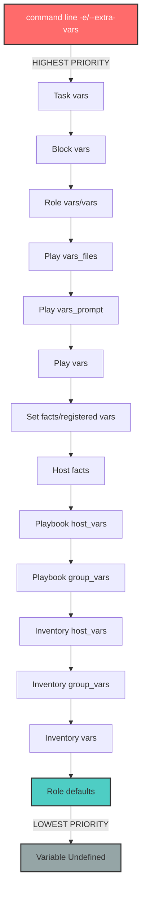

# Ansible Project: Complete Variable Reference

## Table of Contents

1. [Introduction](#introduction)
2. [Variable Precedence Hierarchy](#variable-precedence-hierarchy)
3. [Global Variables](#global-variables)
4. [Role-Specific Variables](#role-specific-variables)
   - [common Role](#common-role-variables)
   - [repos Role](#repos-role-variables)
   - [rpm-dev Role](#rpm-dev-role-variables)
   - [nas Role](#nas-role-variables)
   - [zsh Role](#zsh-role-variables)
   - [osbuild Role](#osbuild-role-variables)
5. [Distribution-Specific Overrides](#distribution-specific-overrides)
6. [Secrets Management](#secrets-management)
7. [Customization Patterns](#customization-patterns)
8. [Examples](#examples)
9. [Variable Naming Conventions](#variable-naming-conventions)
10. [Cross-References](#cross-references)

---

## Introduction

### Purpose of This Document

This document serves as the **authoritative reference** for all variables used across the Ansible project. It provides comprehensive documentation for:

- **Global variables** that affect multiple roles and playbooks
- **Role-specific variables** that control individual role behavior
- **Distribution-specific overrides** for Fedora, RHEL, and Rocky Linux
- **Secrets management** using Ansible Vault
- **Customization patterns** for extending and overriding defaults

### How to Use This Documentation

1. **Quick Lookup**: Use the Table of Contents to navigate to specific roles or variable categories
2. **Understanding Precedence**: Review the [Variable Precedence Hierarchy](#variable-precedence-hierarchy) to understand how variables are resolved
3. **Customization**: Refer to [Customization Patterns](#customization-patterns) for best practices on overriding defaults
4. **Examples**: See [Examples](#examples) for practical use cases

### SFL Documentation Approach

This documentation applies **Systemic Functional Linguistics (SFL)** principles:

- **Material Processes**: Variables are documented by the transformations they enable
- **Modality Calibration**: Language precisely reflects determinism (will/must vs. may/might)
- **Relational Processes**: Variable relationships and dependencies are explicitly mapped

### Quick Navigation Guide

| I need to... | Go to... |
|:-------------|:---------|
| Configure system timezone/locale | [common Role Variables](#common-role-variables) |
| Customize GRUB bootloader settings | [common Role Variables - GRUB Configuration](#grub-bootloader-configuration) |
| Enable third-party repositories | [repos Role Variables](#repos-role-variables) |
| Set up RPM development environment | [rpm-dev Role Variables](#rpm-dev-role-variables) |
| Configure NFS/Samba/Rsync | [nas Role Variables](#nas-role-variables) |
| Customize shell configuration | [zsh Role Variables](#zsh-role-variables) |
| Understand variable precedence | [Variable Precedence Hierarchy](#variable-precedence-hierarchy) |
| Manage encrypted secrets | [Secrets Management](#secrets-management) |

---

## Variable Precedence Hierarchy

### Ansible Variable Precedence (Lowest to Highest)

Ansible resolves variables using a **deterministic precedence hierarchy**. Understanding this hierarchy is critical for predictable automation outcomes.



### Practical Implications

| Priority Level | Variable Source | Use Case | Example |
|:---------------|:---------------|:---------|:--------|
| **HIGHEST** | Command-line `-e` | Temporary overrides for testing | `ansible-playbook site.yml -e "nas_enable_nfs=false"` |
| **HIGH** | Role `vars/main.yml` | Role-internal constants | Distribution package names |
| **MEDIUM** | Playbook `vars_files` | Play-specific configuration | Global `vars/main.yml` |
| **LOW** | Inventory `host_vars/group_vars` | Environment-specific settings | Production vs. staging |
| **LOWEST** | Role `defaults/main.yml` | Sensible defaults | Role configuration options |

### Best Practices

1. **Role Defaults**: Use `defaults/main.yml` for **configurable options** that users should override
2. **Role Vars**: Use `vars/main.yml` for **internal constants** that should not change (e.g., package names)
3. **Global Vars**: Place project-wide settings in `vars/main.yml` at the project root
4. **Distribution Vars**: Store OS-specific values in `vars/Fedora.yml` or role-level `vars/Fedora.yml`
5. **Inventory**: Use `host_vars` and `group_vars` for environment-specific customization

---

## Global Variables

### Location

- **Main Variables**: `/home/b08x/WorkspaceV2/RHEL/ansible/vars/main.yml`
- **Distribution Variables**: `/home/b08x/WorkspaceV2/RHEL/ansible/vars/Fedora.yml`
- **Secrets**: `/home/b08x/WorkspaceV2/RHEL/ansible/vars/secrets.yml` (Ansible Vault encrypted)

### vars/main.yml

**Current Status**: The global `vars/main.yml` file is currently **empty**. This file is reserved for future project-wide variable definitions.

**Intended Use**:
- Cross-role configuration that affects multiple playbooks
- Global defaults that should be consistent across all roles
- Project-level constants (e.g., organization name, domain)

### vars/Fedora.yml

This file **defines distribution-specific packages and customizations** for Fedora systems.

#### Package Groups

| Variable | Type | Description |
|:---------|:-----|:------------|
| `groups` | List[Dict] | DNF package groups to install (e.g., `development-tools`, `container-management`) |
| `packages.common` | List[Dict] | Core system packages required on all Fedora hosts |
| `packages.virt` | List[Dict] | Virtualization stack (libvirt, KVM, QEMU, virt-manager) |
| `packages.containers` | List[Dict] | Container runtimes (Docker CE, Podman, compose plugins) |

**Example Package Definition Structure**:

```yaml
packages:
  common:
    - name: "kernel"
      version: "*"
    - name: "ansible"
      version: "*"
```

#### System Customizations

| Variable | Type | Default | Description |
|:---------|:-----|:--------|:------------|
| `customizations.timezone.timezone` | String | `"America/New_York"` | System timezone (IANA format) |
| `customizations.timezone.ntpservers` | List[String] | `["0.pool.ntp.org", "1.pool.ntp.org"]` | NTP server list for time synchronization |
| `customizations.locale.languages` | List[String] | `["en_US.UTF-8"]` | System locales to generate |
| `customizations.locale.keyboard` | String | `"us"` | Keyboard layout |
| `customizations.user.name` | String | `"devuser"` | Default development user name |
| `customizations.user.description` | String | `"Development User"` | User GECOS field |
| `customizations.user.password` | String | Hashed password | Encrypted password (SHA-512) |
| `customizations.user.shell` | String | `"/bin/bash"` | User's login shell |
| `customizations.user.key` | String | SSH public key | SSH authorized key for user |
| `customizations.user.groups` | List[String] | `["wheel", "docker"]` | Supplementary groups |

**Note**: The `customizations` structure is designed for **OSBuild/Image Builder integration** but can be used by roles as a global reference.

#### Package Categories Breakdown

**Common Packages** (26 packages):
- **Kernel**: Full kernel stack with headers, modules, tools
- **System Tools**: bash, coreutils, bind-utils, tar, rsync
- **Filesystems**: erofs-utils, cifs-utils, nfs-utils, nbd
- **Networking**: NetworkManager, firewalld, chrony, bluez
- **Ansible**: ansible core + collections (posix, general, docker, podman, postgresql, libvirt)
- **System Roles**: linux-system-roles, fedora-workstation-repositories

**Virtualization Packages** (13 packages):
- **Libvirt**: libvirt daemon (KVM variant), client, tools
- **QEMU**: qemu-kvm, qemu-img
- **Management**: virt-install, virt-viewer, virt-manager
- **Networking**: ebtables, dnsmasq, bridge-utils
- **Guest Tools**: libguestfs-tools

**Container Packages** (6 packages):
- **Docker CE**: docker-ce, docker-ce-cli, docker-compose-plugin, docker-buildx-plugin
- **Podman**: podman, podman-compose

---

## Role-Specific Variables

### common Role Variables

**Role Path**: `/home/b08x/WorkspaceV2/RHEL/ansible/roles/common`

This role **transforms** target hosts by applying baseline system configuration including timezone, locale, keyboard layout, and GRUB bootloader settings.

#### System Configuration

| Variable Name | Default Value | Type | SFL Analysis |
|:--------------|:--------------|:-----|:-------------|
| `timezone` | `"America/New_York"` | String | **Participant**: The IANA timezone identifier that **determines** the system's local time. The role **ensures** `/etc/localtime` symlinks to this zone. |
| `locale` | `"en_US.UTF-8"` | String | **Participant**: The system locale that **defines** language, character encoding, and regional settings. The role **generates** this locale via `locale-gen` and **sets** it system-wide. |
| `keymap` | `"us"` | String | **Participant**: The keyboard layout identifier that **controls** console and virtual console key mapping. |

#### GRUB Bootloader Configuration

| Variable Name | Default Value | Type | SFL Analysis |
|:--------------|:--------------|:-----|:-------------|
| `bootloader` | `"grub"` | String | **Participant**: The bootloader type. Currently only `"grub"` is supported. |
| `kernel_parameters_default` | `"splash threadirqs mitigations=off"` | String | **Participant**: Default kernel command-line parameters. `splash` enables graphical boot, `threadirqs` enables threaded IRQ handlers (low-latency optimization), `mitigations=off` disables CPU vulnerability mitigations (performance optimization, **reduces security**). |
| `kernel_parameters` | `"ipv6.disable=1 net.ifnames=0"` | String | **Participant**: Additional kernel parameters. `ipv6.disable=1` disables IPv6 stack, `net.ifnames=0` uses traditional ethX naming. |
| `grub_background` | `"/usr/share/backgrounds/syncopated/syncopated016.png"` | String | **Participant**: Absolute path to GRUB splash screen image. The role **templates** this into `/etc/default/grub` and **may fail** if the file does not exist. |
| `grub_enable_os_prober` | `false` | Boolean | **Participant**: Controls OS detection for dual-boot. `false` disables `os-prober` to prevent auto-detection of other operating systems. |

**Combined Kernel Parameters**: The role **concatenates** `kernel_parameters_default` and `kernel_parameters` into `GRUB_CMDLINE_LINUX_DEFAULT`.

**Modality**: The role **will ensure** GRUB configuration is regenerated via `grub2-mkconfig` after changes. This is a **deterministic Material Process**.

#### rc.local Configuration

The `common` role includes optional `rc.local` setup for boot-time script execution.

**Files**:
- Template: `roles/common/templates/rc.local.j2`
- Target: `/etc/rc.d/rc.local` (executable)

**Note**: Modern systems **should prefer** systemd units over `rc.local`, but this option is provided for legacy compatibility.

#### yadm (Yet Another Dotfiles Manager)

The role includes optional yadm initialization for dotfile management.

**Variable** (implicit from tasks):
- Bootstrap script: `{{ user.home }}/.config/yadm/bootstrap`

---

### repos Role Variables

**Role Path**: `/home/b08x/WorkspaceV2/RHEL/ansible/roles/repos`

This role **transforms** the target host's repository configuration by **enabling third-party repositories** and **tuning DNF settings**.

#### Repository Configuration

| Variable Name | Default Value | Type | SFL Analysis |
|:--------------|:--------------|:-----|:-------------|
| `enable_third_party_repos` | `true` | Boolean | **Control Flag**: When `true`, the role **enables** third-party repositories (e.g., RPM Fusion). This is a **gating condition** for repository installation tasks. |
| `network_timeout` | `30` | Integer (seconds) | **Participant**: The DNF network timeout value. The role **configures** `/etc/dnf/dnf.conf` to wait this duration before aborting repository connections. |
| `retry_count` | `3` | Integer | **Participant**: The number of retry attempts for failed DNF operations. The role **ensures** DNF will retry network operations this many times. |

#### RHEL-Specific Repository Flags

| Variable Name | Default Value | Type | SFL Analysis |
|:--------------|:--------------|:-----|:-------------|
| `enable_epel` | `true` | Boolean | **Control Flag**: When `true`, the role **installs** the EPEL (Extra Packages for Enterprise Linux) repository. Only applies when `ansible_distribution` is `RedHat` or `Rocky`. |
| `enable_powertools` | `true` | Boolean | **Control Flag**: When `true`, the role **enables** the PowerTools/CRB repository (additional development packages). RHEL/Rocky only. |
| `enable_rpmfusion` | `true` | Boolean | **Control Flag**: When `true`, the role **installs** RPM Fusion (free and non-free) repositories. |

**Distribution Detection**: The role uses `ansible_distribution` facts to **determine** which repository tasks to execute.

**Modality**:
- Repository installation **will succeed** if the system has internet connectivity and valid DNF configuration.
- Repository installation **may fail** if mirrors are unreachable or GPG keys cannot be verified.

---

### rpm-dev Role Variables

**Role Path**: `/home/b08x/WorkspaceV2/RHEL/ansible/roles/rpm-dev`

This role **transforms** a target host into a **complete RPM development environment** by installing development tools, configuring Mock build system, and creating the rpmbuild directory structure.

#### User Configuration

| Variable Name | Default Value | Type | SFL Analysis |
|:--------------|:--------------|:-----|:-------------|
| `rpm_dev_user.name` | `"{{ ansible_user_id }}"` | String | **Participant**: The username for RPM development. Defaults to the current Ansible user. The role **adds** this user to the `mock` group. |
| `rpm_dev_user.groups` | `["mock"]` | List[String] | **Participant**: Supplementary groups for the RPM developer. The role **ensures** the user is a member of these groups (required for Mock access). |
| `rpm_dev_user.create_home` | `true` | Boolean | **Control Flag**: When `true`, the role **creates** the user's home directory if it does not exist. |

#### Mock Configuration

| Variable Name | Default Value | Type | SFL Analysis |
|:--------------|:--------------|:-----|:-------------|
| `mock_config.enable_network` | `false` | Boolean | **Participant**: Mock network access. `false` enforces isolated builds (best practice). The role **templates** this into `/etc/mock/site-defaults.cfg`. |
| `mock_config.enable_bootstrap` | `true` | Boolean | **Participant**: Enables Mock's bootstrap chroot feature. **Improves** build reliability by using a two-stage build process. |
| `mock_config.use_host_resolv` | `false` | Boolean | **Participant**: When `false`, Mock uses its own DNS resolution (isolated builds). |
| `mock_config.cache_topdir` | `"/var/cache/mock"` | String | **Participant**: Root directory for Mock's build cache. The role **ensures** this directory exists with appropriate permissions. |
| `mock_config.root_cache_enable` | `true` | Boolean | **Participant**: Enables caching of chroot environments. **Accelerates** subsequent builds. |
| `mock_config.yum_cache_enable` | `true` | Boolean | **Participant**: Enables caching of downloaded packages (YUM/DNF). |
| `mock_config.dnf_cache_enable` | `true` | Boolean | **Participant**: Enables DNF-specific caching. |
| `mock_config.cleanup_on_success` | `true` | Boolean | **Participant**: When `true`, Mock **removes** the build chroot after successful builds (saves disk space). |
| `mock_config.cleanup_on_failure` | `false` | Boolean | **Participant**: When `false`, Mock **preserves** the chroot after failed builds (enables debugging). |

#### RPM Build Environment

| Variable Name | Default Value | Type | SFL Analysis |
|:--------------|:--------------|:-----|:-------------|
| `rpm_build.create_directories` | `true` | Boolean | **Control Flag**: When `true`, the role **creates** the rpmbuild directory tree. |
| `rpm_build.setup_macros` | `true` | Boolean | **Control Flag**: When `true`, the role **templates** `~/.rpmmacros` with user-specific RPM build macros. |
| `rpm_build.home_dir` | `"{{ user.home }}"` | String | **Participant**: The base directory for RPM development. Defaults to the user's home directory. |
| `rpm_build.build_dir` | `"{{ user.home }}/rpmbuild"` | String | **Participant**: The rpmbuild root directory. The role **creates** subdirectories beneath this path. |
| `rpm_build.directories` | `["BUILD", "RPMS", "SOURCES", "SPECS", "SRPMS"]` | List[String] | **Participants**: The standard rpmbuild directory structure. The role **ensures** all directories exist. |

#### Mock Build Targets

| Variable Name | Default Value | Type | SFL Analysis |
|:--------------|:--------------|:-----|:-------------|
| `mock_targets` | `["fedora-42-x86_64", "fedora-42-aarch64", "fedora-43-x86_64", "fedora-43-aarch64"]` | List[String] | **Participants**: Mock build configurations to initialize. The role **may** pre-populate the cache for these targets. |

#### Package Installation Control

| Variable Name | Default Value | Type | SFL Analysis |
|:--------------|:--------------|:-----|:-------------|
| `rpm_dev_install_packages` | `true` | Boolean | **Control Flag**: When `true`, the role **installs** the complete RPM development toolchain. |
| `rpm_dev_setup_user` | `true` | Boolean | **Control Flag**: When `true`, the role **configures** the user account (groups, permissions). |
| `rpm_dev_setup_mock` | `true` | Boolean | **Control Flag**: When `true`, the role **configures** the Mock build system. |
| `rpm_dev_setup_directories` | `true` | Boolean | **Control Flag**: When `true`, the role **creates** the rpmbuild directory structure. |

#### Distribution-Specific Variables (Fedora)

**File**: `roles/rpm-dev/vars/Fedora.yml`

| Variable Name | Value | Type | SFL Analysis |
|:--------------|:------|:-----|:-------------|
| `packages__rpm_dev` | 21 packages | List[String] | **Participants**: Core RPM development tools including `@development-tools` group, `rpm-build`, `rpmdevtools`, `mock`, `fedpkg`, `koji`, and utilities. |
| `packages__mock_deps` | 4 packages | List[String] | **Participants**: Mock dependencies (`systemd-container`, `dnf`, `dnf-plugins-core`, `usermode`). |
| `packages__dev_tools` | 4 packages | List[String] | **Participants**: Development utilities (`vim-enhanced`, `nano`, `tree`, `less`). |
| `packages.rpm_dev` | Combined list | List[String] | **Computed Participant**: The role **concatenates** all package lists into this single installation list. |

**Key Packages**:
- **@development-tools**: C/C++ compiler, make, autotools
- **rpm-build**: RPM package building tools
- **rpmdevtools**: RPM development utilities (rpmdev-setuptree, rpmdev-newspec)
- **rpmlint**: RPM package linter
- **mock**: Isolated build environment
- **fedpkg**: Fedora package management CLI
- **koji**: Fedora build system client

---

### nas Role Variables

**Role Path**: `/home/b08x/WorkspaceV2/RHEL/ansible/roles/nas`

This role **transforms** a target host into a **Network Attached Storage (NAS) server** by installing and configuring NFS, Samba, and Rsync services.

#### Service Enable Flags

| Variable Name | Default Value | Type | SFL Analysis |
|:--------------|:--------------|:-----|:-------------|
| `nas_enable_nfs` | `true` | Boolean | **Control Flag**: When `true`, the role **installs** NFS server packages, **configures** `/etc/exports`, and **ensures** the NFS service is running. |
| `nas_enable_samba` | `false` | Boolean | **Control Flag**: When `true`, the role **installs** Samba packages, **templates** `/etc/samba/smb.conf`, and **starts** the SMB service. |
| `nas_enable_rsync` | `false` | Boolean | **Control Flag**: When `true`, the role **installs** rsync daemon, **configures** `/etc/rsyncd.conf`, and **enables** the rsyncd service. |

#### NFS Configuration

##### NFS User/Group

| Variable Name | Default Value | Type | SFL Analysis |
|:--------------|:--------------|:-----|:-------------|
| `nas_nfs_user_name` | `"nobody"` | String | **Participant**: The NFSv4 ID mapping user. The role **ensures** this user exists and **owns** NFS export directories. |
| `nas_nfs_user_group` | `"nobody"` | String | **Participant**: The NFSv4 ID mapping group. |
| `nas_nfs_user_uid` | `65534` | Integer | **Participant**: UID for the NFS user (nobody standard UID). |
| `nas_nfs_user_gid` | `65534` | Integer | **Participant**: GID for the NFS group. |

##### NFS Domain and Network Access

| Variable Name | Default Value | Type | SFL Analysis |
|:--------------|:--------------|:-----|:-------------|
| `nas_nfs_domain` | `"{{ ansible_domain \| default('localdomain') }}"` | String | **Participant**: The NFSv4 domain for ID mapping (`/etc/idmapd.conf`). The role **derives** this from the system's DNS domain. |
| `nas_nfs_allowed_networks` | `["192.168.41.0/24"]` | List[String] | **Participants**: CIDR network blocks allowed to mount NFS exports. The role **templates** these into `/etc/exports` entries. |

##### NFS Export Options

| Variable Name | Default Value | Type | SFL Analysis |
|:--------------|:--------------|:-----|:-------------|
| `nas_nfs_export_options` | `["rw", "sync", "no_subtree_check"]` | List[String] | **Participants**: Default NFS export options. `rw` enables read-write, `sync` ensures writes are committed before acknowledgment, `no_subtree_check` improves performance by disabling subtree verification. |
| `nas_nfs_root_export_options` | `["rw", "fsid=0", "no_subtree_check", "sync"]` | List[String] | **Participants**: Options for the NFSv4 root export. `fsid=0` designates the NFSv4 pseudo-root. |

##### NFS Exports

| Variable Name | Default Value | Type | SFL Analysis |
|:--------------|:--------------|:-----|:-------------|
| `nas_nfs_exports` | See below | List[Dict] | **Participants**: List of directories to export via NFS. Each export **must** contain a `path` key. |

**NFS Export Structure**:

```yaml
nas_nfs_exports:
  - path: /srv/nfs              # Required: Directory to export
    create_dir: true            # Optional: Create if missing (default: false)
    is_root: true               # Optional: Mark as NFSv4 root (default: false)
    clients:                    # Optional: Override nas_nfs_allowed_networks
      - "192.168.41.0/24"
    options:                    # Optional: Override nas_nfs_export_options
      - rw
      - nohide
      - insecure
      - no_subtree_check
      - sync
    owner: nobody               # Optional: Directory owner (default: nas_nfs_user_name)
    group: nobody               # Optional: Directory group (default: nas_nfs_user_group)
    mode: '0755'                # Optional: Directory permissions (default: '0755')
```

**Default Export**:

```yaml
nas_nfs_exports:
  - path: /srv/nfs
    create_dir: true
    is_root: true
```

##### NFS Firewall Configuration

| Variable Name | Default Value | Type | SFL Analysis |
|:--------------|:--------------|:-----|:-------------|
| `firewall.nfs.ports.rpcbind` | `111` | Integer | **Participant**: RPC portmapper port (TCP/UDP). The role **opens** this port in firewalld. |
| `firewall.nfs.ports.nfs` | `2049` | Integer | **Participant**: Main NFS server port (TCP/UDP). |
| `firewall.nfs.ports.lockd.tcp` | `32803` | Integer | **Participant**: NFS lock manager TCP port. The role **configures** this fixed port in `/etc/nfs.conf` to avoid ephemeral port issues. |
| `firewall.nfs.ports.lockd.udp` | `32769` | Integer | **Participant**: NFS lock manager UDP port. |
| `firewall.nfs.ports.mountd` | `892` | Integer | **Participant**: NFS mount daemon port (TCP/UDP). |
| `firewall.nfs.ports.statd` | `662` | Integer | **Participant**: NFS status monitor port (TCP/UDP). |
| `firewall.nfs.ports.rdma` | `20049` | Integer | **Participant**: NFS over RDMA port (if enabled). |
| `nas_nfs_firewall_ports` | `[]` | List[String] | **Optional Participants**: Custom firewall ports (format: `"2049/tcp"`). If defined, the role uses explicit port rules instead of firewalld services. |

**Firewall Strategy**: The role uses a **hybrid approach**:
1. Firewalld services (`nfs`, `mountd`, `rpc-bind`) for standard ports
2. Explicit port configuration in `/etc/nfs.conf` to **prevent ephemeral port allocation**
3. Optional custom port rules via `nas_nfs_firewall_ports`

#### Samba Configuration

##### Samba User/Group

| Variable Name | Default Value | Type | SFL Analysis |
|:--------------|:--------------|:-----|:-------------|
| `nas_samba_user` | `"smbuser"` | String | **Participant**: The system user for Samba file ownership. The role **creates** this user if it does not exist. |
| `nas_samba_group` | `"smbgroup"` | String | **Participant**: The system group for Samba file ownership. |
| `nas_samba_uid` | `1036` | Integer | **Participant**: UID for the Samba user. |
| `nas_samba_gid` | `1036` | Integer | **Participant**: GID for the Samba group. |
| `nas_samba_user_system` | `false` | Boolean | **Control Flag**: If `true`, creates a system user (UID < 1000). |
| `nas_samba_group_system` | `false` | Boolean | **Control Flag**: If `true`, creates a system group (GID < 1000). |

##### Samba Global Settings

| Variable Name | Default Value | Type | SFL Analysis |
|:--------------|:--------------|:-----|:-------------|
| `nas_samba_workgroup` | `"WORKGROUP"` | String | **Participant**: The SMB workgroup name. The role **templates** this into `/etc/samba/smb.conf` `[global]` section. |
| `nas_samba_server_string` | `"Samba Server %v"` | String | **Participant**: The server description string (`%v` expands to Samba version). |
| `nas_samba_netbios_name` | `"{{ ansible_hostname \| upper }}"` | String | **Participant**: NetBIOS name (derived from hostname). |

##### Samba Security Settings

| Variable Name | Default Value | Type | SFL Analysis |
|:--------------|:--------------|:-----|:-------------|
| `nas_samba_server_min_protocol` | `"NT1"` | String | **Participant**: Minimum SMB protocol version accepted by the server. `NT1` allows legacy clients (SMB1). **Security Warning**: SMB1 is deprecated and insecure; use `SMB2` or higher in production. |
| `nas_samba_client_min_protocol` | `"NT1"` | String | **Participant**: Minimum SMB protocol version for client connections. |
| `nas_samba_client_max_protocol` | `"SMB3"` | String | **Participant**: Maximum SMB protocol version for client connections. |
| `nas_samba_ntlm_auth` | `"ntlmv1-permitted"` | String | **Participant**: NTLM authentication policy. **Security Warning**: NTLMv1 is weak; use `ntlmv2-only` in production. |

##### Samba Network Access Control

| Variable Name | Default Value | Type | SFL Analysis |
|:--------------|:--------------|:-----|:-------------|
| `nas_samba_hosts_allow` | `["127.0.0.1", "192.168.41.0/24"]` | List[String] | **Participants**: IP addresses/networks allowed to connect. The role **templates** this into the `hosts allow` directive. |

##### Samba File/Directory Permissions

| Variable Name | Default Value | Type | SFL Analysis |
|:--------------|:--------------|:-----|:-------------|
| `nas_samba_create_mask` | `"0664"` | String | **Participant**: Octal permissions for newly created files. `0664` grants rw-rw-r--. |
| `nas_samba_directory_mask` | `"2755"` | String | **Participant**: Octal permissions for newly created directories. `2755` sets SGID bit + rwxr-xr-x. |
| `nas_samba_force_create_mode` | `"0644"` | String | **Participant**: Forced permission bits for files (overrides client umask). |
| `nas_samba_force_directory_mode` | `"2755"` | String | **Participant**: Forced permission bits for directories (SGID ensures group inheritance). |

##### Samba Shares

| Variable Name | Default Value | Type | SFL Analysis |
|:--------------|:--------------|:-----|:-------------|
| `nas_samba_shares` | See below | List[Dict] | **Participants**: List of SMB shares to create. Each share **must** contain `name` and `path` keys. |

**Samba Share Structure**:

```yaml
nas_samba_shares:
  - name: shared                # Required: Share name
    path: /srv/samba/shared     # Required: Directory path
    comment: Shared Files       # Optional: Share description
    browseable: true            # Optional: Visible in network browse (default: true)
    public: false               # Optional: Allow guest access (default: false)
    read_only: false            # Optional: Read-only share (default: false)
    create_dir: true            # Optional: Create directory (default: false)
    owner: root                 # Optional: Directory owner
    group: smbgroup             # Optional: Directory group
    mode: '0775'                # Optional: Directory permissions
    valid_users:                # Optional: List of allowed users/groups
      - mediauser
      - "@smbgroup"
    write_list:                 # Optional: Users with write access
      - mediauser
```

**Default Share**:

```yaml
nas_samba_shares:
  - name: shared
    path: /srv/samba/shared
    comment: Shared Files
    browseable: true
    public: false
    create_dir: true
    owner: root
    group: "{{ nas_samba_group }}"
    mode: "0775"
```

##### Samba Service Options

| Variable Name | Default Value | Type | SFL Analysis |
|:--------------|:--------------|:-----|:-------------|
| `nas_samba_enable_nmb` | `true` | Boolean | **Control Flag**: When `true`, the role **starts** the NetBIOS name service (`nmb`). Required for Windows network browsing. |
| `nas_samba_enable_client_firewall` | `false` | Boolean | **Control Flag**: When `true`, the role **opens** the `samba-client` firewall service (for outbound Samba client connections). |
| `nas_samba_enable_homes` | `true` | Boolean | **Control Flag**: When `true`, enables the `[homes]` special share (auto-shares user home directories). |
| `nas_samba_disable_printing` | `true` | Boolean | **Control Flag**: When `true`, disables printer sharing (`load printers = no`). |

#### Rsync Daemon Configuration

##### Rsync User/Group

| Variable Name | Default Value | Type | SFL Analysis |
|:--------------|:--------------|:-----|:-------------|
| `nas_rsync_user` | `"nobody"` | String | **Participant**: The user for rsync daemon file operations. |
| `nas_rsync_group` | `"nobody"` | String | **Participant**: The group for rsync daemon file operations. |
| `nas_rsync_uid` | `65534` | Integer | **Participant**: UID for rsync daemon. |
| `nas_rsync_gid` | `65534` | Integer | **Participant**: GID for rsync daemon. |

##### Rsync Daemon Settings

| Variable Name | Default Value | Type | SFL Analysis |
|:--------------|:--------------|:-----|:-------------|
| `nas_rsync_max_connections` | `4` | Integer | **Participant**: Maximum concurrent rsync daemon connections. The role **configures** this in `/etc/rsyncd.conf`. |
| `nas_rsync_use_chroot` | `false` | Boolean | **Participant**: When `true`, rsync daemon runs in a chroot jail (increased security, may break symlinks). |
| `nas_rsync_syslog_facility` | `"local5"` | String | **Participant**: Syslog facility for rsync daemon logging. |

##### Rsync Modules

| Variable Name | Default Value | Type | SFL Analysis |
|:--------------|:--------------|:-----|:-------------|
| `nas_rsync_modules` | See below | List[Dict] | **Participants**: List of rsync daemon modules (shares). Each module **must** contain `name` and `path` keys. |

**Rsync Module Structure**:

```yaml
nas_rsync_modules:
  - name: shared                # Required: Module name
    path: /srv/rsync/shared     # Required: Directory path
    comment: Shared Files via Rsync  # Optional: Module description
    read_only: false            # Optional: Read-only module (default: false)
    list: true                  # Optional: Allow listing (default: true)
    uid: nobody                 # Optional: User for operations (default: nas_rsync_user)
    gid: nobody                 # Optional: Group for operations (default: nas_rsync_group)
    hosts_allow:                # Optional: Allowed hosts/networks
      - "192.168.41.0/24"
    hosts_deny:                 # Optional: Denied hosts/networks
      - "*"
```

**Default Module**:

```yaml
nas_rsync_modules:
  - name: shared
    path: /srv/rsync/shared
    comment: Shared Files via Rsync
    read_only: false
```

#### Distribution-Specific Variables (Fedora)

**File**: `roles/nas/vars/Fedora.yml`

| Variable Name | Value | Type | SFL Analysis |
|:--------------|:------|:-----|:-------------|
| `nas_packages_nfs` | `["nfs-utils", "rpcbind"]` | List[String] | **Participants**: NFS server packages for Fedora. |
| `nas_packages_samba` | `["samba", "samba-client", "samba-common"]` | List[String] | **Participants**: Samba server and client packages. |
| `nas_packages_rsync` | `["rsync", "xinetd"]` | List[String] | **Participants**: Rsync daemon and optional xinetd. |
| `nas_service_nfs` | `"nfs-server"` | String | **Participant**: Systemd service name for NFS server on Fedora. |
| `nas_service_nfs_idmapd` | `"nfs-idmapd"` | String | **Participant**: NFSv4 ID mapping service. |
| `nas_service_rpcbind` | `"rpcbind"` | String | **Participant**: RPC portmapper service. |
| `nas_service_samba` | `"smb"` | String | **Participant**: Samba server service name (Fedora uses `smb`, not `smbd`). |
| `nas_service_nmb` | `"nmb"` | String | **Participant**: NetBIOS name service. |
| `nas_firewall_backend` | `"firewalld"` | String | **Participant**: Firewall management tool (Fedora uses firewalld). |

---

### zsh Role Variables

**Role Path**: `/home/b08x/WorkspaceV2/RHEL/ansible/roles/zsh`

This role **transforms** the user's shell environment by **installing Zsh**, **configuring Oh My Zsh**, and **customizing shell behavior** with modern productivity tools.

#### Directory Configuration

| Variable Name | Default Value | Type | SFL Analysis |
|:--------------|:--------------|:-----|:-------------|
| `profile_config_dir` | `"{{ user.home }}"` | String | **Participant**: The directory where Zsh profile files (`.zshrc`, `.zprofile`) are stored. Defaults to the user's home directory. |

#### Desktop Environment

| Variable Name | Default Value | Type | SFL Analysis |
|:--------------|:--------------|:-----|:-------------|
| `desktop` | `"sway"` | String | **Participant**: The desktop environment or window manager to start via `.zprofile`. Options include `sway`, `i3`, `dwm`, `awesome`, `bspwm`, `xmonad`, `gnome`, `kde`, or empty string for server installations. The role **templates** the appropriate `startx` or compositor command. |

#### Zsh Theme

| Variable Name | Default Value | Type | SFL Analysis |
|:--------------|:--------------|:-----|:-------------|
| `zsh_theme` | `"robbyrussell"` | String | **Participant**: The Oh My Zsh theme to use. The role **overrides** hostname-based theme selection in `.zshrc`. See [Oh My Zsh Themes](https://github.com/ohmyzsh/ohmyzsh/wiki/Themes) for available options. |

#### Optional Installations

| Variable Name | Default Value | Type | SFL Analysis |
|:--------------|:--------------|:-----|:-------------|
| `zoxide_install` | `true` | Boolean | **Control Flag**: When `true`, the role **downloads** and **installs** [zoxide](https://github.com/ajeetdsouza/zoxide) (a smarter `cd` command) from GitHub releases. |
| `oh_my_zsh_install` | `true` | Boolean | **Control Flag**: When `true`, the role **installs** Oh My Zsh framework. Set to `false` if Oh My Zsh is already installed to avoid re-installation. |

#### Optional Features

| Variable Name | Default Value | Type | SFL Analysis |
|:--------------|:--------------|:-----|:-------------|
| `zsh_set_default_shell` | `false` | Boolean | **Control Flag**: When `true`, the role **changes** the user's default shell to `/bin/zsh` via `chsh`. Requires `sudo` privileges. |

#### Hardware-Specific Settings

| Variable Name | Default Value | Type | SFL Analysis |
|:--------------|:--------------|:-----|:-------------|
| `libva_driver` | Undefined | String | **Optional Participant**: The VA-API driver for hardware video acceleration. Example: `"i965"` for Intel GPUs, `"radeonsi"` for AMD. The role **exports** this as `LIBVA_DRIVER_NAME` environment variable. Override in `host_vars` for specific hardware. |

**Example**:

```yaml
# host_vars/my-intel-laptop.yml
libva_driver: "i965"
```

#### Distribution-Specific Variables (Fedora)

**File**: `roles/zsh/vars/Fedora.yml`

| Variable Name | Value | Type | SFL Analysis |
|:--------------|:------|:-----|:-------------|
| `packages__zsh` | `["zsh", "zsh-syntax-highlighting", "zsh-completions"]` | List[String] | **Participants**: Zsh packages available in Fedora repositories. Note: `oh-my-zsh`, `zoxide`, and `zsh-autocomplete` are **not** in standard repos and are installed via role tasks. |

---

### osbuild Role Variables

**Role Path**: `/home/b08x/WorkspaceV2/RHEL/ansible/roles/osbuild`

This role is currently a **placeholder** with minimal configuration.

#### Status

- **defaults/main.yml**: Empty (contains only SPDX license header)
- **vars/main.yml**: Empty (contains only SPDX license header)

**Future Purpose**: This role is intended for **OSBuild/Image Builder** integration to create custom operating system images.

---

## Distribution-Specific Overrides

### How Distribution Detection Works

Ansible automatically collects **facts** about target hosts, including:

- `ansible_distribution`: OS distribution name (e.g., `Fedora`, `RedHat`, `Rocky`)
- `ansible_distribution_major_version`: Major version number (e.g., `42` for Fedora 42)
- `ansible_os_family`: OS family (e.g., `RedHat` for Fedora/RHEL/Rocky/CentOS)

Roles use these facts to **dynamically load** distribution-specific variables:

```yaml
# Common pattern in roles/*/tasks/main.yml
- name: Load distribution-specific variables
  ansible.builtin.include_vars: "{{ ansible_distribution }}.yml"
  when: ansible_distribution in ['Fedora', 'RedHat', 'Rocky']
```

### When to Use Distribution Overrides

Use distribution-specific variable files when:

1. **Package names differ** between distributions (e.g., `nfs-utils` vs. `nfs-kernel-server`)
2. **Service names differ** (e.g., `nfs-server` on Fedora vs. `nfs-server.service` on RHEL)
3. **Configuration paths differ** (e.g., `/etc/sysconfig` vs. `/etc/default`)
4. **Feature availability differs** (e.g., newer packages only in Fedora)

### Current Distribution Files

#### Global: vars/Fedora.yml

**Purpose**: Defines Fedora-specific packages and customizations that apply across all roles.

**Key Variables**:
- `groups`: Package groups (`development-tools`, `container-management`)
- `packages.common`: Fedora common packages
- `packages.virt`: Fedora virtualization packages
- `packages.containers`: Fedora container runtimes
- `customizations`: User, timezone, locale defaults for Fedora

#### Role-Specific: roles/*/vars/Fedora.yml

| Role | File | Purpose |
|:-----|:-----|:--------|
| `nas` | `roles/nas/vars/Fedora.yml` | Fedora NFS/Samba/Rsync package and service names |
| `rpm-dev` | `roles/rpm-dev/vars/Fedora.yml` | Fedora RPM development packages |
| `zsh` | `roles/zsh/vars/Fedora.yml` | Fedora Zsh packages |

### Extending for Other Distributions

To add support for a new distribution (e.g., Ubuntu):

1. Create global distribution file: `vars/Ubuntu.yml`
2. Create role-specific files: `roles/*/vars/Ubuntu.yml`
3. Update role tasks to include the new distribution:

```yaml
- name: Load distribution-specific variables
  ansible.builtin.include_vars: "{{ ansible_distribution }}.yml"
  when: ansible_distribution in ['Fedora', 'RedHat', 'Rocky', 'Ubuntu', 'Debian']
```

4. Map variables to distribution-specific values:

```yaml
# roles/nas/vars/Ubuntu.yml
nas_service_nfs: nfs-kernel-server  # Different from Fedora's nfs-server
nas_packages_nfs:
  - nfs-kernel-server
  - rpcbind
```

---

## Secrets Management

### Critical Security Information

The file `/home/b08x/WorkspaceV2/RHEL/ansible/vars/secrets.yml` is **encrypted with Ansible Vault** and contains sensitive credentials that **must never** be committed to version control in plaintext.

### Variables Stored in secrets.yml

| Variable Name | Type | Purpose | Used By |
|:--------------|:-----|:--------|:--------|
| `gmail_username` | String | Gmail account username (email address) | `playbooks/postfix_gmail.yml` |
| `gmail_app_password` | String | Gmail app-specific password (NOT regular password) | `playbooks/postfix_gmail.yml` |

**Security Warning**: These credentials **grant email sending capabilities**. Unauthorized access could result in:
- Email spoofing
- Spam/phishing attacks attributed to your account
- Gmail account suspension

### Ansible Vault Operations

#### Viewing Encrypted Secrets

```bash
# View the encrypted file (requires vault password)
ansible-vault view /home/b08x/WorkspaceV2/RHEL/ansible/vars/secrets.yml
```

**Output Example**:

```yaml
---
gmail_username: "your-email@gmail.com"
gmail_app_password: "abcd efgh ijkl mnop"  # 16-character app password
```

#### Editing Encrypted Secrets

```bash
# Edit the encrypted file (opens in $EDITOR)
ansible-vault edit /home/b08x/WorkspaceV2/RHEL/ansible/vars/secrets.yml
```

**Process**:
1. Prompts for vault password
2. Decrypts to temporary file
3. Opens in editor (vim, nano, etc.)
4. Re-encrypts on save

#### Creating New Encrypted Files

```bash
# Create a new encrypted file
ansible-vault create /home/b08x/WorkspaceV2/RHEL/ansible/vars/new_secrets.yml
```

#### Changing Vault Password

```bash
# Rotate the vault password
ansible-vault rekey /home/b08x/WorkspaceV2/RHEL/ansible/vars/secrets.yml
```

#### Running Playbooks with Vault-Encrypted Variables

**Interactive Password Prompt**:

```bash
ansible-playbook playbooks/postfix_gmail.yml --ask-vault-pass
```

**Vault Password File** (more secure for automation):

```bash
# Create password file (MUST be protected)
echo "my-strong-vault-password" > ~/.vault_pass
chmod 600 ~/.vault_pass

# Use password file
ansible-playbook playbooks/postfix_gmail.yml --vault-password-file ~/.vault_pass
```

**Multiple Vault IDs** (for different secret categories):

```bash
# Encrypt with specific vault ID
ansible-vault encrypt --vault-id prod@prompt vars/prod_secrets.yml

# Run with multiple vault IDs
ansible-playbook site.yml --vault-id dev@~/.vault_pass_dev --vault-id prod@prompt
```

### Security Best Practices

1. **Never Commit Plaintext Secrets**: Always encrypt before adding to version control
2. **Use App Passwords**: For Gmail, create app-specific passwords (not your main password)
3. **Rotate Regularly**: Change vault passwords and app passwords periodically
4. **Restrict File Permissions**: `chmod 600` on vault password files
5. **Separate Vault IDs**: Use different vault IDs for dev/staging/production
6. **Audit Access**: Monitor who has vault password access
7. **Use External Secret Managers**: For production, consider HashiCorp Vault, AWS Secrets Manager, or Azure Key Vault

### Gmail App Password Setup

**Required for `postfix_gmail.yml` playbook**:

1. Enable 2-factor authentication on your Google account
2. Visit [Google App Passwords](https://myaccount.google.com/apppasswords)
3. Select "Mail" and your device type
4. Copy the 16-character password (format: `xxxx xxxx xxxx xxxx`)
5. Store in `vars/secrets.yml`:

```yaml
---
gmail_username: "your-email@gmail.com"
gmail_app_password: "abcd efgh ijkl mnop"
```

6. Encrypt the file:

```bash
ansible-vault encrypt vars/secrets.yml
```

### Vault Password Management Strategies

**Strategy 1: Interactive (Secure, Manual)**

- Prompt for password on each playbook run
- Best for: Development, infrequent runs
- Command: `--ask-vault-pass`

**Strategy 2: Password File (Convenient, Requires File Security)**

- Store password in a protected file
- Best for: Frequent runs, automation
- Command: `--vault-password-file ~/.vault_pass`
- **CRITICAL**: `chmod 600 ~/.vault_pass` and **never commit to git**

**Strategy 3: Environment Variable (Automation)**

- Store password in environment variable
- Best for: CI/CD pipelines, containers
- Setup:

```bash
export ANSIBLE_VAULT_PASSWORD_FILE=~/.vault_pass
ansible-playbook site.yml  # Automatically uses password file
```

**Strategy 4: External Secret Manager (Production)**

- Retrieve vault password from external system
- Best for: Production, multi-team environments
- Example with HashiCorp Vault:

```bash
# vault_password_script.sh
#!/bin/bash
vault kv get -field=password secret/ansible/vault
chmod +x vault_password_script.sh

ansible-playbook site.yml --vault-password-file ./vault_password_script.sh
```

---

## Customization Patterns

### Using Inventory Variables (group_vars, host_vars)

**Recommended Pattern**: Store environment-specific and host-specific overrides in inventory directories.

**Directory Structure**:

```
inventory/
├── production/
│   ├── hosts.ini
│   ├── group_vars/
│   │   ├── all.yml
│   │   ├── webservers.yml
│   │   └── databases.yml
│   └── host_vars/
│       ├── web01.example.com.yml
│       └── db01.example.com.yml
└── staging/
    ├── hosts.ini
    └── group_vars/
        └── all.yml
```

**Example: Override NFS Settings for Production**:

```yaml
# inventory/production/group_vars/nas_servers.yml
nas_nfs_allowed_networks:
  - "10.0.0.0/8"
  - "172.16.0.0/12"

nas_nfs_exports:
  - path: /srv/production/data
    create_dir: true
    is_root: true
    options:
      - rw
      - sync
      - no_subtree_check
      - root_squash  # Production security: prevent root access
```

### Overriding Role Defaults

**Pattern 1: Playbook-Level Override**:

```yaml
# playbooks/configure_nas.yml
---
- name: Configure NAS Server
  hosts: nas_servers
  become: true
  vars:
    nas_enable_nfs: true
    nas_enable_samba: false  # Override default
  roles:
    - role: nas
```

**Pattern 2: Role Parameters**:

```yaml
# playbooks/site.yml
---
- name: Configure Development Environment
  hosts: dev_workstations
  become: true
  roles:
    - role: rpm-dev
      vars:
        rpm_dev_user:
          name: "developer"
          groups: ["mock", "docker"]
        mock_targets:
          - fedora-42-x86_64
          - centos-stream-9-x86_64
```

**Pattern 3: Include Variables from External File**:

```yaml
# playbooks/configure_custom.yml
---
- name: Custom Configuration
  hosts: all
  become: true
  vars_files:
    - "../vars/custom_overrides.yml"
  roles:
    - common
    - repos
```

### Extra Vars on Command Line (-e or --extra-vars)

**Highest Precedence**: Command-line extra vars **always** override other variable sources.

**Use Cases**:
- Temporary overrides for testing
- CI/CD pipeline parameters
- Emergency configuration changes

**Examples**:

```bash
# Disable NFS temporarily
ansible-playbook playbooks/configure_nas.yml -e "nas_enable_nfs=false"

# Override multiple variables (JSON format)
ansible-playbook playbooks/configure_nas.yml -e '{"nas_enable_nfs": true, "nas_enable_samba": true}'

# Override multiple variables (YAML file)
ansible-playbook playbooks/configure_nas.yml -e "@custom_vars.yml"

# Override timezone for testing
ansible-playbook playbooks/site.yml -e "timezone=America/Los_Angeles"

# Set Mock build targets dynamically
ansible-playbook playbooks/rpm-dev.yml -e "mock_targets=['fedora-42-x86_64', 'rhel-9-x86_64']"
```

### Best Practices for Variable Organization

#### 1. Separation of Concerns

| Variable Type | Location | Example |
|:--------------|:---------|:--------|
| **Role Defaults** | `roles/*/defaults/main.yml` | Configurable options with sensible defaults |
| **Role Constants** | `roles/*/vars/main.yml` | Internal constants (package names, service names) |
| **Global Config** | `vars/main.yml` | Project-wide settings |
| **Distribution** | `vars/Fedora.yml` or `roles/*/vars/Fedora.yml` | OS-specific values |
| **Environment** | `inventory/prod/group_vars/all.yml` | Environment-specific settings |
| **Host-Specific** | `inventory/prod/host_vars/hostname.yml` | Single-host customization |
| **Secrets** | `vars/secrets.yml` (encrypted) | Sensitive credentials |

#### 2. Naming Conventions

**Follow Role Prefixing**:

```yaml
# Good: Role-prefixed variables prevent conflicts
nas_enable_nfs: true
nas_nfs_exports: []
rpm_dev_user: {}

# Bad: Generic names risk conflicts across roles
enable_nfs: true  # Conflicts with other roles
exports: []       # Too generic
user: {}          # Ambiguous
```

#### 3. Documentation

**Comment Complex Variables**:

```yaml
# NFS Firewall Configuration
# These ports are configured in /etc/nfs.conf to avoid ephemeral port issues
# Changing these values requires updating both firewall rules and NFS daemon config
firewall:
  nfs:
    ports:
      lockd:
        tcp: 32803  # NFS lock manager TCP port
        udp: 32769  # NFS lock manager UDP port
```

#### 4. Default Values

**Provide Sensible Defaults**:

```yaml
# Good: Defaults work out-of-the-box for common use cases
nas_nfs_allowed_networks:
  - "192.168.41.0/24"

# Bad: Requires user to always override
nas_nfs_allowed_networks: []  # Forces users to configure
```

#### 5. Validation

**Use Ansible Assertions for Critical Variables**:

```yaml
# roles/nas/tasks/main.yml
- name: Validate NFS configuration
  ansible.builtin.assert:
    that:
      - nas_nfs_exports | length > 0
      - nas_nfs_allowed_networks | length > 0
    fail_msg: "NFS exports and allowed networks must be defined"
    success_msg: "NFS configuration validated successfully"
  when: nas_enable_nfs
```

---

## Examples

### Example 1: Custom Timezone Configuration

**Scenario**: Change system timezone to Pacific Time.

**Method 1: Inventory Override**:

```yaml
# inventory/production/group_vars/all.yml
timezone: "America/Los_Angeles"
```

**Method 2: Playbook Override**:

```yaml
# playbooks/configure_pacific.yml
---
- name: Configure Pacific Timezone
  hosts: all
  become: true
  vars:
    timezone: "America/Los_Angeles"
  roles:
    - common
```

**Method 3: Command-Line Override**:

```bash
ansible-playbook playbooks/site.yml -e "timezone=America/Los_Angeles"
```

### Example 2: Enabling Specific Repositories

**Scenario**: Enable EPEL and PowerTools on RHEL hosts.

```yaml
# inventory/production/group_vars/rhel_servers.yml
enable_epel: true
enable_powertools: true
enable_rpmfusion: false  # Disable RPM Fusion on RHEL
```

**Run**:

```bash
ansible-playbook playbooks/configure_repos.yml -i inventory/production/hosts.ini
```

### Example 3: Customizing GRUB Kernel Parameters

**Scenario**: Enable IPv6 and use predictable network interface names.

```yaml
# inventory/production/host_vars/server01.yml
kernel_parameters: "net.ifnames=1"  # Override to enable predictable names
kernel_parameters_default: "splash quiet"  # Remove mitigations=off for security
```

**Result**: Combined kernel parameters will be `splash quiet net.ifnames=1`.

### Example 4: NAS Network Configuration

**Scenario**: Configure NFS server with multiple network ranges and custom exports.

```yaml
# inventory/production/group_vars/nas_servers.yml
nas_enable_nfs: true
nas_enable_samba: false
nas_enable_rsync: false

nas_nfs_allowed_networks:
  - "10.0.0.0/8"          # Internal network
  - "192.168.1.0/24"      # Management network

nas_nfs_exports:
  - path: /srv/nfs
    create_dir: true
    is_root: true
  - path: /srv/nfs/shared
    create_dir: true
    options:
      - rw
      - nohide
      - sync
      - no_subtree_check
  - path: /srv/nfs/backups
    create_dir: true
    options:
      - rw
      - nohide
      - sync
      - no_subtree_check
      - root_squash  # Security: prevent root write access
    owner: backup
    group: backup
    mode: '0770'
```

### Example 5: Mock Architecture Configuration

**Scenario**: Configure Mock for cross-architecture builds (x86_64 and aarch64).

```yaml
# inventory/production/host_vars/build-server.yml
mock_targets:
  - fedora-42-x86_64
  - fedora-42-aarch64
  - fedora-43-x86_64
  - fedora-43-aarch64
  - centos-stream-9-x86_64
  - centos-stream-9-aarch64

mock_config:
  enable_network: false      # Isolated builds
  enable_bootstrap: true     # Two-stage builds for reliability
  cache_topdir: /var/cache/mock
  root_cache_enable: true    # Cache chroot environments
  yum_cache_enable: true     # Cache downloaded packages
  cleanup_on_success: true   # Save disk space
  cleanup_on_failure: false  # Keep failed builds for debugging
```

**Run**:

```bash
ansible-playbook playbooks/rpm-dev.yml -i inventory/production/hosts.ini --limit build-server
```

### Example 6: Using Vault-Encrypted Variables

**Scenario**: Configure Postfix to send email via Gmail.

**Step 1: Create/Edit Secrets**:

```bash
ansible-vault edit vars/secrets.yml
```

**Content**:

```yaml
---
gmail_username: "alerts@example.com"
gmail_app_password: "abcd efgh ijkl mnop"
```

**Step 2: Create Playbook**:

```yaml
# playbooks/postfix_gmail.yml
---
- name: Configure Postfix for Gmail Relay
  hosts: mail_servers
  become: true
  vars_files:
    - "../vars/secrets.yml"
  tasks:
    - name: Configure Postfix SASL password
      ansible.builtin.template:
        src: sasl_passwd.j2
        dest: /etc/postfix/sasl_passwd
        owner: root
        group: root
        mode: '0600'
      notify: reload postfix
```

**Step 3: Run with Vault Password**:

```bash
ansible-playbook playbooks/postfix_gmail.yml --ask-vault-pass
```

### Example 7: Multi-Environment Configuration

**Scenario**: Configure different NAS settings for dev, staging, and production.

**Structure**:

```
inventory/
├── dev/
│   ├── hosts.ini
│   └── group_vars/
│       └── nas_servers.yml
├── staging/
│   ├── hosts.ini
│   └── group_vars/
│       └── nas_servers.yml
└── production/
    ├── hosts.ini
    └── group_vars/
        └── nas_servers.yml
```

**Development**:

```yaml
# inventory/dev/group_vars/nas_servers.yml
nas_nfs_allowed_networks:
  - "192.168.1.0/24"  # Local dev network

nas_nfs_exports:
  - path: /srv/nfs/dev
    create_dir: true
    is_root: true
    options:
      - rw
      - sync
      - no_subtree_check
      - no_root_squash  # Dev: Allow root access for testing
```

**Production**:

```yaml
# inventory/production/group_vars/nas_servers.yml
nas_nfs_allowed_networks:
  - "10.0.0.0/8"      # Production network
  - "172.16.0.0/12"   # Backup network

nas_nfs_exports:
  - path: /srv/nfs/prod
    create_dir: true
    is_root: true
    options:
      - rw
      - sync
      - no_subtree_check
      - root_squash  # Production: Security hardened
```

**Run**:

```bash
# Deploy to development
ansible-playbook playbooks/configure_nas.yml -i inventory/dev/hosts.ini

# Deploy to production
ansible-playbook playbooks/configure_nas.yml -i inventory/production/hosts.ini
```

---

## Variable Naming Conventions

### Role-Specific Prefixing

**Pattern**: All variables in a role **should be prefixed** with the role name to prevent conflicts.

| Role | Prefix | Examples |
|:-----|:-------|:---------|
| `common` | None (global) | `timezone`, `locale`, `kernel_parameters` |
| `repos` | `enable_*` | `enable_epel`, `enable_powertools` |
| `rpm-dev` | `rpm_dev_*`, `mock_*` | `rpm_dev_user`, `mock_config`, `mock_targets` |
| `nas` | `nas_*` | `nas_enable_nfs`, `nas_nfs_exports`, `nas_samba_shares` |
| `zsh` | `zsh_*`, `zoxide_*`, `oh_my_zsh_*` | `zsh_theme`, `zoxide_install`, `oh_my_zsh_install` |

**Exception**: Global configuration variables (e.g., `timezone`, `locale`) in the `common` role do not require prefixing as they represent system-wide settings.

### Enable Flags Pattern

**Pattern**: Boolean flags that control feature enablement follow the `*_enable_*` naming convention.

**Examples**:

```yaml
# Service-level enables
nas_enable_nfs: true
nas_enable_samba: false
nas_enable_rsync: false

# Feature-level enables
rpm_dev_install_packages: true
rpm_dev_setup_user: true
rpm_dev_setup_mock: true

# Repository enables
enable_epel: true
enable_powertools: true
enable_rpmfusion: true

# Optional feature enables
zoxide_install: true
oh_my_zsh_install: true
zsh_set_default_shell: false
```

**Benefits**:
- **Clarity**: Immediately identifiable as control flags
- **Consistency**: Uniform pattern across roles
- **Defaults**: Typically `true` for primary features, `false` for optional features

### Distribution Variables Pattern

**Pattern**: Distribution-specific variables are stored in `vars/{{ ansible_distribution }}.yml` files.

**Naming**:
- **Package Lists**: `packages__*` (double underscore indicates internal use)
- **Service Names**: `*_service_*`
- **Firewall Backend**: `*_firewall_backend`

**Examples**:

```yaml
# roles/nas/vars/Fedora.yml
nas_packages_nfs: ["nfs-utils", "rpcbind"]
nas_service_nfs: "nfs-server"
nas_firewall_backend: "firewalld"

# roles/rpm-dev/vars/Fedora.yml
packages__rpm_dev: ["@development-tools", "rpm-build", "mock"]
packages__mock_deps: ["systemd-container", "dnf"]
packages:
  rpm_dev: "{{ packages__rpm_dev + packages__mock_deps }}"
```

### Nested Variable Structures

**Pattern**: Use nested dictionaries for related configuration.

**Examples**:

```yaml
# User configuration
rpm_dev_user:
  name: "{{ ansible_user_id }}"
  groups: ["mock"]
  create_home: true

# Mock configuration
mock_config:
  enable_network: false
  enable_bootstrap: true
  cache_topdir: /var/cache/mock

# RPM build environment
rpm_build:
  create_directories: true
  home_dir: "{{ user.home }}"
  build_dir: "{{ user.home }}/rpmbuild"
  directories:
    - BUILD
    - RPMS
    - SOURCES

# Firewall configuration
firewall:
  nfs:
    ports:
      rpcbind: 111
      nfs: 2049
      lockd:
        tcp: 32803
        udp: 32769
```

**Benefits**:
- **Organization**: Related settings grouped logically
- **Readability**: Clear hierarchical structure
- **Namespacing**: Prevents flat variable namespace pollution

### List Variables for Multi-Item Configuration

**Pattern**: Use lists of dictionaries for resources that can have multiple instances.

**Examples**:

```yaml
# NFS exports
nas_nfs_exports:
  - path: /srv/nfs
    create_dir: true
    is_root: true
  - path: /srv/nfs/shared
    options: ["rw", "nohide", "sync"]

# Samba shares
nas_samba_shares:
  - name: shared
    path: /srv/samba/shared
    browseable: true
  - name: media
    path: /storage/media
    valid_users: ["mediauser"]

# Rsync modules
nas_rsync_modules:
  - name: backups
    path: /backups
    read_only: true

# Mock targets
mock_targets:
  - fedora-42-x86_64
  - fedora-42-aarch64
```

### Variable Type Indicators

**Pattern**: Use suffixes to indicate variable type when not obvious from context.

| Suffix | Type | Example |
|:-------|:-----|:--------|
| `_dir` | Directory path | `profile_config_dir`, `rpm_build.home_dir` |
| `_file` | File path | `grub_background` |
| `_list` | List | `packages.common` |
| `_enable` | Boolean flag | `nas_enable_nfs`, `root_cache_enable` |
| `_count` | Integer | `retry_count`, `nas_rsync_max_connections` |
| `_timeout` | Time duration | `network_timeout` |

---

## Cross-References

### Related Documentation

- **Main Project README**: `/home/b08x/WorkspaceV2/RHEL/ansible/README.md`
- **Role-Specific READMEs**:
  - `/home/b08x/WorkspaceV2/RHEL/ansible/roles/common/README.md`
  - `/home/b08x/WorkspaceV2/RHEL/ansible/roles/repos/README.md`
  - `/home/b08x/WorkspaceV2/RHEL/ansible/roles/rpm-dev/README.md`
  - `/home/b08x/WorkspaceV2/RHEL/ansible/roles/nas/README.md`
  - `/home/b08x/WorkspaceV2/RHEL/ansible/roles/zsh/README.md`
  - `/home/b08x/WorkspaceV2/RHEL/ansible/roles/osbuild/README.md`

### External References

- **Ansible Variable Precedence**: [Official Documentation](https://docs.ansible.com/ansible/latest/playbook_guide/playbooks_variables.html#understanding-variable-precedence)
- **Ansible Vault**: [Official Documentation](https://docs.ansible.com/ansible/latest/vault_guide/index.html)
- **Oh My Zsh Themes**: [Wiki](https://github.com/ohmyzsh/ohmyzsh/wiki/Themes)
- **zoxide**: [GitHub Repository](https://github.com/ajeetdsouza/zoxide)
- **Mock Build System**: [Fedora Wiki](https://fedoraproject.org/wiki/Mock)
- **NFS Configuration**: [Red Hat Documentation](https://access.redhat.com/documentation/en-us/red_hat_enterprise_linux/9/html/managing_file_systems/exporting-nfs-shares_managing-file-systems)
- **Samba Configuration**: [Official Wiki](https://wiki.samba.org/index.php/Main_Page)

### Quick Links

| Task | Documentation Section |
|:-----|:---------------------|
| Understanding variable precedence | [Variable Precedence Hierarchy](#variable-precedence-hierarchy) |
| Customizing system configuration | [common Role Variables](#common-role-variables) |
| Enabling repositories | [repos Role Variables](#repos-role-variables) |
| Setting up RPM development | [rpm-dev Role Variables](#rpm-dev-role-variables) |
| Configuring NAS services | [nas Role Variables](#nas-role-variables) |
| Customizing shell | [zsh Role Variables](#zsh-role-variables) |
| Managing secrets | [Secrets Management](#secrets-management) |
| Overriding variables | [Customization Patterns](#customization-patterns) |
| Variable naming | [Variable Naming Conventions](#variable-naming-conventions) |

---

## Document Maintenance

**Last Updated**: 2025-12-03
**Version**: 1.0.0
**Maintainer**: Ansible Project Team

**Change Log**:
- 2025-12-03: Initial comprehensive variable reference documentation created

**Contributing**:
When adding new roles or modifying existing variables, update this document:
1. Add new role section under [Role-Specific Variables](#role-specific-variables)
2. Document all new variables with SFL analysis
3. Update [Variable Naming Conventions](#variable-naming-conventions) if introducing new patterns
4. Add practical examples to [Examples](#examples)
5. Update [Cross-References](#cross-references) with new documentation links
