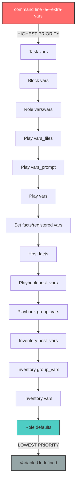

# Ansible Project: Complete Variable Reference

## Table of Contents

1. [Introduction](#introduction)
2. [Variable Precedence Hierarchy](#variable-precedence-hierarchy)
3. [Global Variables](#global-variables)
4. [Role-Specific Variables](#role-specific-variables)
   - [base Role](#base-role-variables) - **CONSOLIDATED** (replaces common + repos)
   - [asdf Role](#asdf-role-variables)
   - [audio Role](#audio-role-variables)
   - [docker Role](#docker-role-variables)
   - [kiwi Role](#kiwi-role-variables)
   - [libvirt Role](#libvirt-role-variables)
   - [nas Role](#nas-role-variables)
   - [osbuild Role](#osbuild-role-variables)
   - [podman Role](#podman-role-variables)
   - [rpm-dev Role](#rpm-dev-role-variables)
   - [sway Role](#sway-role-variables)
   - [systemd-networkd Role](#systemd-networkd-role-variables)
   - [video Role](#video-role-variables)
   - [workstation Role](#workstation-role-variables)
   - [zsh Role](#zsh-role-variables)
5. [Distribution-Specific Overrides](#distribution-specific-overrides)
6. [Secrets Management](#secrets-management)
7. [Customization Patterns](#customization-patterns)
8. [Examples](#examples)
9. [Variable Naming Conventions](#variable-naming-conventions)
10. [Cross-References](#cross-references)

---

## Introduction

### Purpose of This Document

This document serves as the **authoritative reference** for all variables used across the Ansible project. It provides comprehensive documentation for:

- **Global variables** that affect multiple roles and playbooks
- **Role-specific variables** that control individual role behavior
- **Distribution-specific overrides** for Fedora, RHEL, and Rocky Linux
- **Secrets management** using Ansible Vault
- **Customization patterns** for extending and overriding defaults

### How to Use This Documentation

1. **Quick Lookup**: Use the Table of Contents to navigate to specific roles or variable categories
2. **Understanding Precedence**: Review the [Variable Precedence Hierarchy](#variable-precedence-hierarchy) to understand how variables are resolved
3. **Customization**: Refer to [Customization Patterns](#customization-patterns) for best practices on overriding defaults
4. **Examples**: See [Examples](#examples) for practical use cases

### Project Path

```
/home/b08x/Workspace/OS/ansible-collection-rhel-workstation-builder/
```

### Quick Navigation Guide

| I need to... | Go to... |
|:-------------|:---------|
| Configure system timezone/locale | [base Role](#base-role-variables) |
| Customize GRUB bootloader settings | [base Role - GRUB Configuration](#grub-bootloader-configuration) |
| Configure audio workstation | [audio Role](#audio-role-variables) |
| Set up container runtime | [podman Role](#podman-role-variables) or [docker Role](#docker-role-variables) |
| Configure GPU/Video drivers | [video Role](#video-role-variables) |
| Build custom ISO images | [kiwi Role](#kiwi-role-variables) or [osbuild Role](#osbuild-role-variables) |
| Set up RPM development environment | [rpm-dev Role](#rpm-dev-role-variables) |
| Configure systemd-networkd/resolved | [systemd-networkd Role](#systemd-networkd-role-variables) |
| Configure NFS/Samba/Rsync | [nas Role](#nas-role-variables) |
| Customize shell configuration | [zsh Role](#zsh-role-variables) |
| Configure Sway/Wayland | [sway Role](#sway-role-variables) |
| Install workstation applications | [workstation Role](#workstation-role-variables) |
| Manage version managers | [asdf Role](#asdf-role-variables) |
| Configure virtualization | [libvirt Role](#libvirt-role-variables) |
| Understand variable precedence | [Variable Precedence Hierarchy](#variable-precedence-hierarchy) |
| Manage encrypted secrets | [Secrets Management](#secrets-management) |

---

## Variable Precedence Hierarchy

### Ansible Variable Precedence (Lowest to Highest)

Ansible resolves variables using a **deterministic precedence hierarchy**. Understanding this hierarchy is critical for predictable automation outcomes.



### Practical Implications

| Priority Level | Variable Source | Use Case | Example |
|:---------------|:---------------|:---------|:--------|
| **HIGHEST** | Command-line `-e` | Temporary overrides for testing | `ansible-playbook site.yml -e "nas_enable_nfs=false"` |
| **HIGH** | Role `vars/main.yml` | Role-internal constants | Distribution package names |
| **MEDIUM** | Playbook `vars_files` | Play-specific configuration | Global `vars/main.yml` |
| **LOW** | Inventory `host_vars/group_vars` | Environment-specific settings | Production vs. staging |
| **LOWEST** | Role `defaults/main.yml` | Sensible defaults | Role configuration options |

### Best Practices

1. **Role Defaults**: Use `defaults/main.yml` for **configurable options** that users should override
2. **Role Vars**: Use `vars/main.yml` for **internal constants** that should not change (e.g., package names)
3. **Global Vars**: Place project-wide settings in `vars/main.yml` at the project root
4. **Distribution Vars**: Store OS-specific values in `vars/Fedora.yml` or role-level `vars/Fedora.yml`
5. **Inventory**: Use `host_vars` and `group_vars` for environment-specific customization

---

## Global Variables

### Location

- **Main Variables**: `vars/main.yml`
- **Distribution Variables**: `vars/Fedora.yml`
- **Secrets**: `vars/secrets.yml` (Ansible Vault encrypted)

### vars/main.yml

**Current Status**: The global `vars/main.yml` file is currently **empty**. This file is reserved for future project-wide variable definitions.

**Intended Use**:
- Cross-role configuration that affects multiple playbooks
- Global defaults that should be consistent across all roles
- Project-level constants (e.g., organization name, domain)

### vars/Fedora.yml

This file **defines distribution-specific packages and customizations** for Fedora systems.

#### Package Groups

| Variable | Type | Description |
|:---------|:-----|:------------|
| `groups` | List[Dict] | DNF package groups to install (e.g., `development-tools`, `container-management`) |
| `packages.common` | List[Dict] | Core system packages required on all Fedora hosts |
| `packages.virt` | List[Dict] | Virtualization stack (libvirt, KVM, QEMU, virt-manager) |
| `packages.containers` | List[Dict] | Container runtimes (Docker CE, Podman, compose plugins) |

---

## Role-Specific Variables

### base Role Variables

**Role Path**: `roles/base`

**Purpose**: Consolidated system foundation combining repository management and common functionality. **Replaces** the deprecated `common` and `repos` roles.

#### System Configuration

| Variable Name | Default Value | Type | Description |
|:--------------|:--------------|:-----|:------------|
| `timezone` | `"America/New_York"` | String | System timezone (IANA format) |
| `locale` | `"en_US.UTF-8"` | String | System locale |
| `keymap` | `"us"` | String | Keyboard layout |

#### Repository Configuration

| Variable Name | Default Value | Type | Description |
|:--------------|:--------------|:-----|:------------|
| `enable_third_party_repos` | `true` | Boolean | Enable third-party repositories (RPM Fusion) |
| `network_timeout` | `30` | Integer | DNF network timeout (seconds) |
| `retry_count` | `3` | Integer | DNF retry attempts |
| `enable_epel` | `true` | Boolean | Enable EPEL repository (RHEL/Rocky) |
| `enable_powertools` | `true` | Boolean | Enable PowerTools/CRB repository |
| `enable_rpmfusion` | `true` | Boolean | Enable RPM Fusion repositories |

#### GRUB Bootloader Configuration

| Variable Name | Default Value | Type | Description |
|:--------------|:--------------|:-----|:------------|
| `bootloader` | `"grub"` | String | Bootloader type (currently only grub) |
| `kernel_parameters_default` | `"splash threadirqs mitigations=off"` | String | Default kernel params |
| `kernel_parameters` | `"ipv6.disable=1 net.ifnames=0"` | String | Additional kernel params |
| `grub_background` | `"/usr/share/backgrounds/syncopated/syncopated016.png"` | String | GRUB splash image |
| `grub_enable_os_prober` | `false` | Boolean | Enable OS prober for dual-boot |
| `cpupower_max_freq` | `"3.9GHz"` | String | CPU frequency governor max |

#### System Packages

| Variable Name | Default Value | Type | Description |
|:--------------|:--------------|:-----|:------------|
| `common_groups` | `["wheel", "video", "render", "libvirt"]` | List | System groups |
| `common_kernel_packages` | 9 packages | List | Kernel and development packages |
| `common_utility_packages` | 30 packages | List | Base utilities (git, vim, zsh, etc.) |
| `base_pkgs_dev` | 12 packages | List | Development dependencies |
| `base_packages_cockpit` | 14 packages | List | Cockpit web UI packages |

---

### asdf Role Variables

**Role Path**: `roles/asdf`

**Purpose**: Multi-language version manager (Ruby, Python, Node.js, Go, etc.)

#### Configuration

| Variable Name | Default Value | Type | Description |
|:--------------|:--------------|:-----|:------------|
| `asdf_install_dir` | `"{{ user.home }}/.asdf"` | String | Installation directory |
| `asdf_enable_plugins` | `["ruby", "python", "nodejs"]` | List | Enabled language plugins |
| `asdf_global_tools` | `[]` | List | Tools to install globally |

---

### audio Role Variables

**Role Path**: `roles/audio`

**Purpose**: Professional audio workstation with PipeWire/JACK, realtime tuning, and DAW optimization.

#### Audio System Configuration

| Variable Name | Default Value | Type | Description |
|:--------------|:--------------|:-----|:------------|
| `audio_system` | `"pipewire"` | String | Audio server: `"pipewire"` or `"pulseaudio_jack"` |
| `audio_packages` | 6 packages | List | Core audio packages |

#### JACK Configuration (when audio_system: pulseaudio_jack)

| Variable Name | Default Value | Type | Description |
|:--------------|:--------------|:-----|:------------|
| `jack.dps.device` | `"hw:0"` | String | Audio device |
| `jack.dps.rate` | `48000` | Integer | Sample rate |
| `jack.dps.period` | `1024` | Integer | Buffer period |
| `jack.eps.realtime` | `true` | Boolean | Enable realtime scheduling |
| `jack.eps.realtimepriority` | `10` | Integer | Realtime priority |

---

### docker Role Variables

**Role Path**: `roles/docker`

**Purpose**: Docker container runtime configuration.

#### Configuration

| Variable Name | Default Value | Type | Description |
|:--------------|:--------------|:-----|:------------|
| `docker_install` | `true` | Boolean | Install Docker |
| `docker_packages` | Docker CE, CLI, compose | List | Docker packages |
| `docker_service_enable` | `true` | Boolean | Enable Docker service |

---

### kiwi Role Variables

**Role Path**: `roles/kiwi`

**Purpose**: KIWI NG system for building custom live ISO images with NVIDIA/Intel oneAPI support.

#### Build Configuration

| Variable Name | Default Value | Type | Description |
|:--------------|:--------------|:-----|:------------|
| `kiwi_desktop` | `"gnome"` | String | Desktop environment: `"gnome"` or `"sway"` |
| `kiwi_include_nvidia` | `true` | Boolean | Include NVIDIA driver support |
| `kiwi_include_intel_oneapi` | `true` | Boolean | Include Intel oneAPI toolkits |
| `kiwi_fedora_version` | `43` | Integer | Fedora version for ISO |
| `kiwi_build_async` | `true` | Boolean | Run build asynchronously |
| `kiwi_async_timeout` | `7200` | Integer | Build timeout (seconds) |
| `kiwi_include_rpmdev` | `true` | Boolean | Include RPM development tools |
| `kiwi_include_audio` | `true` | Boolean | Include audio workstation packages |

#### Kernel/Build Options

| Variable Name | Default Value | Type | Description |
|:--------------|:--------------|:-----|:------------|
| `kiwi_kernel_options` | `""` | String | Additional kernel boot parameters |
| `kiwi_initrd_append` | `""` | String | Additional initrd append options |

---

### libvirt Role Variables

**Role Path**: `roles/libvirt`

**Purpose**: Libvirt/KVM virtualization management.

#### Configuration

| Variable Name | Default Value | Type | Description |
|:--------------|:--------------|:-----|:------------|
| `libvirt_install` | `true` | Boolean | Install libvirt |
| `libvirt_packages` | libvirt, qemu-kvm, virt-install | List | Virtualization packages |
| `libvirt_service_enable` | `true` | Boolean | Enable libvirtd service |

---

### nas Role Variables

**Role Path**: `roles/nas`

**Purpose**: Network Attached Storage server (NFS, Samba, Rsync).

#### Service Enable Flags

| Variable Name | Default Value | Type | Description |
|:--------------|:--------------|:-----|:------------|
| `nas_enable_nfs` | `true` | Boolean | Enable NFS server |
| `nas_enable_samba` | `false` | Boolean | Enable Samba server |
| `nas_enable_rsync` | `false` | Boolean | Enable Rsync daemon |

#### NFS Configuration

| Variable Name | Default Value | Type | Description |
|:--------------|:--------------|:-----|:------------|
| `nas_nfs_user_name` | `"nobody"` | String | NFS user |
| `nas_nfs_user_group` | `"nobody"` | String | NFS group |
| `nas_nfs_domain` | `"{{ ansible_domain \| default('localdomain') }}"` | String | NFSv4 domain |
| `nas_nfs_allowed_networks` | `["192.168.41.0/24"]` | List | Allowed CIDR networks |
| `nas_nfs_exports` | `[{path: /srv/nfs, create_dir: true, is_root: true}]` | List | NFS export definitions |

#### Samba Configuration

| Variable Name | Default Value | Type | Description |
|:--------------|:--------------|:-----|:------------|
| `nas_samba_user` | `"smbuser"` | String | Samba user |
| `nas_samba_workgroup` | `"WORKGROUP"` | String | SMB workgroup |
| `nas_samba_server_min_protocol` | `"NT1"` | String | Minimum SMB protocol |
| `nas_samba_ntlm_auth` | `"ntlmv1-permitted"` | String | NTLM auth policy |
| `nas_samba_shares` | `[{name: shared, path: /srv/samba/shared}]` | List | Share definitions |

#### Rsync Configuration

| Variable Name | Default Value | Type | Description |
|:--------------|:--------------|:-----|:------------|
| `nas_rsync_user` | `"nobody"` | String | Rsync daemon user |
| `nas_rsync_max_connections` | `4` | Integer | Max concurrent connections |
| `nas_rsync_modules` | `[{name: shared, path: /srv/rsync/shared}]` | List | Rsync module definitions |

---

### osbuild Role Variables

**Role Path**: `roles/osbuild`

**Purpose**: OSBuild Composer integration for building custom system images.

#### Build Configuration

| Variable Name | Default Value | Type | Description |
|:--------------|:--------------|:-----|:------------|
| `osbuild_blueprint_name` | `"custom-workstation"` | String | Blueprint name |
| `osbuild_compose_type` | `"fedora-iot-commit"` | String | Output image type |
| `osbuild_image_size` | `"10GB"` | String | Image size |
| `osbuild_retry_count` | `3` | Integer | Build retry attempts |
| `osbuild_dnf5_retry` | `true` | Boolean | Enable DNF5 retry logic |

#### Blueprint Options

| Variable Name | Default Value | Type | Description |
|:--------------|:--------------|:-----|:------------|
| `osbuild_enable_gnome` | `true` | Boolean | Include GNOME desktop |
| `osbuild_enable_kde` | `false` | Boolean | Include KDE desktop |
| `osbuild_enable_cockpit` | `true` | Boolean | Include Cockpit web UI |
| `osbuild_custom_packages` | `[]` | List | Additional packages |

---

### podman Role Variables

**Role Path**: `roles/podman`

**Purpose**: Podman container runtime with NVIDIA GPU passthrough and CDI support.

#### Configuration

| Variable Name | Default Value | Type | Description |
|:--------------|:--------------|:-----|:------------|
| `podman_install` | `true` | Boolean | Install Podman |
| `podman_packages` | `["podman", "podman-compose", "podman-docker"]` | List | Podman packages |
| `podman_install_nvidia_ctk` | `true` | Boolean | Install NVIDIA Container Toolkit |

---

### rpm-dev Role Variables

**Role Path**: `roles/rpm-dev`

**Purpose**: RPM development environment with Mock build system.

#### User Configuration

| Variable Name | Default Value | Type | Description |
|:--------------|:--------------|:-----|:------------|
| `rpm_dev_user.name` | `"{{ ansible_user_id }}"` | String | RPM dev username |
| `rpm_dev_user.groups` | `["mock"]` | List | Supplementary groups |

#### Mock Configuration

| Variable Name | Default Value | Type | Description |
|:--------------|:--------------|:-----|:------------|
| `mock_config.enable_network` | `false` | Boolean | Enable network in chroot |
| `mock_config.enable_bootstrap` | `true` | Boolean | Enable bootstrap mode |
| `mock_config.cache_topdir` | `"/var/cache/mock"` | String | Cache directory |
| `mock_config.root_cache_enable` | `true` | Boolean | Enable root cache |
| `mock_config.cleanup_on_success` | `true` | Boolean | Cleanup after success |

#### Build Targets

| Variable Name | Default Value | Type | Description |
|:--------------|:--------------|:-----|:------------|
| `mock_targets` | `["fedora-42-x86_64", "fedora-43-x86_64"]` | List | Mock build targets |

---

### sway Role Variables

**Role Path**: `roles/sway`

**Purpose**: Sway Wayland compositor configuration with themes, scripts, and bar integration.

#### Sway Configuration

| Variable Name | Default Value | Type | Description |
|:--------------|:--------------|:-----|:------------|
| `sway_config.home` | `"{{ lookup(env,HOME) }}/.config/sway"` | String | Config directory |
| `sway_config.autostart` | `"default"` | String | Autostart configuration |
| `sway_config.workspaces` | `"default"` | String | Workspace configuration |
| `sway_config.keybindings` | `"default"` | String | Keybinding configuration |
| `sway_config.tray_output` | `"primary"` | String | System tray output |

#### Workspace Configuration

| Variable Name | Default Value | Type | Description |
|:--------------|:--------------|:-----|:------------|
| `__wm_workspaces` | `[{id: 1, name: " 1 "}, ... {id: 0, name: " 0 "}]` | List | Workspace definitions |

#### Directory Configuration

| Variable Name | Default Value | Type | Description |
|:--------------|:--------------|:-----|:------------|
| `wm_directory_default_mode` | `"0750"` | String | Default directory mode |
| `wm_directory_default_owner` | `"{{ user.name }}"` | String | Default owner |
| `wm_directory_default_location` | `"{{ user.home }}"` | String | Default location |

#### Terminal Configuration

| Variable Name | Default Value | Type | Description |
|:--------------|:--------------|:-----|:------------|
| `terminal` | `"terminator"` | String | Default terminal |
| `terminal_alt` | `"urxvt"` | String | Alternative terminal |

---

### systemd-networkd Role Variables

**Role Path**: `roles/systemd-networkd`

**Purpose**: systemd-networkd and systemd-resolved network configuration.

#### Global Configuration

| Variable Name | Default Value | Type | Description |
|:--------------|:--------------|:-----|:------------|
| `systemd_run_networkd` | `true` | Boolean | Enable networkd service |
| `systemd_interface_cleanup` | `false` | Boolean | Cleanup unmanaged interfaces |
| `systemd_networkd_prefix` | `"general"` | String | Config file prefix |

#### Network Configuration

| Variable Name | Default Value | Type | Description |
|:--------------|:--------------|:-----|:------------|
| `systemd_networks` | `[]` | List[Dict] | Network interface configs |
| `systemd_netdevs` | `[]` | List[Dict] | Virtual network devices |
| `systemd_link_config_overrides` | `{}` | Dict | Hardware config overrides |

#### Resolved Configuration

| Variable Name | Default Value | Type | Description |
|:--------------|:--------------|:-----|:------------|
| `systemd_resolved` | `{}` | Dict | DNS/resolver settings |
| `systemd_resolved_available` | `true` | Boolean | Manage resolved |

---

### video Role Variables

**Role Path**: `roles/video`

**Purpose**: Intel and NVIDIA GPU configuration with automatic hardware detection.

#### Feature Toggles

| Variable Name | Default Value | Type | Description |
|:--------------|:--------------|:-----|:------------|
| `use_nvidia` | `true` | Boolean | Enable NVIDIA support |
| `use_intel` | `true` | Boolean | Enable Intel GPU support |

#### NVIDIA Configuration

| Variable Name | Default Value | Type | Description |
|:--------------|:--------------|:-----|:------------|
| `nvidia_driver_version` | `"*"` | String | Driver version |
| `nvidia_driver_branch` | `"latest"` | String | Driver branch: `"latest"` or `"lts"` |
| `nvidia_include_cuda` | `true` | Boolean | Include CUDA toolkit |
| `nvidia_configure_cdi` | `true` | Boolean | Configure CDI for containers |
| `nvidia_packages` | 10 packages | List | NVIDIA packages |

#### Intel Configuration

| Variable Name | Default Value | Type | Description |
|:--------------|:--------------|:-----|:------------|
| `intel_include_oneapi` | `true` | Boolean | Include Intel oneAPI |
| `intel_oneapi_mkl_only` | `true` | Boolean | MKL only (vs full basekit) |
| `intel_packages` | 3 packages | List | Intel packages |

#### Repository Priorities

| Variable Name | Default Value | Type | Description |
|:--------------|:--------------|:-----|:------------|
| `video_repo_priorities.fedora` | `0` | Integer | Fedora repo priority |
| `video_repo_priorities.cuda` | `99` | Integer | CUDA repo priority |
| `video_repo_priorities.rpmfusion` | `100` | Integer | RPM Fusion priority |

---

### workstation Role Variables

**Role Path**: `roles/workstation`

**Purpose**: Linux workstation application installation (browsers, IDEs, utilities).

#### Browser Packages

| Variable Name | Default Value | Type | Description |
|:--------------|:--------------|:-----|:------------|
| `pkgs_browsers` | `["google-chrome-stable", "firefox"]` | List | Browser packages |

#### Desktop Environment Packages

| Variable Name | Default Value | Type | Description |
|:--------------|:--------------|:-----|:------------|
| `workstation_gnome_packages` | 8 packages | List | GNOME packages |
| `workstation_sway_packages` | 14 packages | List | Sway/Wayland packages |

#### IDE Packages

| Variable Name | Default Value | Type | Description |
|:--------------|:--------------|:-----|:------------|
| `workstation_ide_packages` | `["code", "antigravity"]` | List | IDE packages |

#### Flatpaks

| Variable Name | Default Value | Type | Description |
|:--------------|:--------------|:-----|:------------|
| `workstation_flatpaks` | `["md.obsidian.Obsidian"]` | List | Flatpak applications |

#### Utility Packages

| Variable Name | Default Value | Type | Description |
|:--------------|:--------------|:-----|:------------|
| `workstation_pkgs_utils` | `["tuned-switcher", "distrobox"]` | List | Utility packages |

---

### zsh Role Variables

**Role Path**: `roles/zsh`

**Purpose**: Zsh shell customization with Oh My Zsh, plugins, and themes.

#### Directory Configuration

| Variable Name | Default Value | Type | Description |
|:--------------|:--------------|:-----|:------------|
| `profile_config_dir` | `"{{ user.home }}"` | String | Profile directory |

#### Desktop Environment

| Variable Name | Default Value | Type | Description |
|:--------------|:--------------|:-----|:------------|
| `desktop` | `"sway"` | String | Desktop environment for autostart |

#### Zsh Configuration

| Variable Name | Default Value | Type | Description |
|:--------------|:--------------|:-----|:------------|
| `zsh_theme` | `"robbyrussell"` | String | Oh My Zsh theme |
| `zoxide_install` | `true` | Boolean | Install zoxide |
| `oh_my_zsh_install` | `true` | Boolean | Install Oh My Zsh |
| `zsh_set_default_shell` | `false` | Boolean | Set Zsh as default shell |

#### Hardware-Specific

| Variable Name | Default Value | Type | Description |
|:--------------|:--------------|:-----|:------------|
| `libva_driver` | Undefined | String | VA-API driver (i965, radeonsi, etc.) |

---

## Distribution-Specific Overrides

### How Distribution Detection Works

Ansible automatically collects **facts** about target hosts, including:

- `ansible_distribution`: OS distribution name (e.g., `Fedora`, `RedHat`, `Rocky`)
- `ansible_distribution_major_version`: Major version number (e.g., `42` for Fedora 42)
- `ansible_os_family`: OS family (e.g., `RedHat` for Fedora/RHEL/Rocky/CentOS)

Roles use these facts to **dynamically load** distribution-specific variables:

```yaml
# Common pattern in roles/*/tasks/main.yml
- name: Load distribution-specific variables
  ansible.builtin.include_vars: "{{ ansible_distribution }}.yml"
  when: ansible_distribution in ['Fedora', 'RedHat', 'Rocky']
```

### Current Distribution Files

#### Global: vars/Fedora.yml

**Purpose**: Defines Fedora-specific packages and customizations that apply across all roles.

**Key Variables**:
- `groups`: Package groups (`development-tools`, `container-management`)
- `packages.common`: Fedora common packages
- `packages.virt`: Fedora virtualization packages
- `packages.containers`: Fedora container runtimes
- `customizations`: User, timezone, locale defaults for Fedora

#### Role-Specific Distribution Files

| Role | File | Purpose |
|:-----|:-----|:--------|
| `audio` | `roles/audio/vars/Fedora.yml` | Audio packages, buffer defaults |
| `nas` | `roles/nas/vars/Fedora.yml` | NFS/Samba/Rsync package and service names |
| `rpm-dev` | `roles/rpm-dev/vars/Fedora.yml` | RPM development packages |
| `sway` | `roles/sway/vars/Fedora.yml` | Sway/Wayland packages (100 lines) |
| `zsh` | `roles/zsh/vars/Fedora.yml` | Zsh packages |

---

## Secrets Management

### Critical Security Information

The file `vars/secrets.yml` is **encrypted with Ansible Vault** and contains sensitive credentials that **must never** be committed to version control in plaintext.

### Variables Stored in secrets.yml

| Variable Name | Type | Purpose | Used By |
|:--------------|:-----|:--------|:--------|
| `gmail_username` | String | Gmail account username | `playbooks/postfix_gmail.yml` |
| `gmail_app_password` | String | Gmail app-specific password | `playbooks/postfix_gmail.yml` |

**Security Warning**: These credentials **grant email sending capabilities**. Unauthorized access could result in:
- Email spoofing
- Spam/phishing attacks attributed to your account
- Gmail account suspension

### Ansible Vault Operations

#### Viewing Encrypted Secrets

```bash
# View the encrypted file (requires vault password)
ansible-vault view vars/secrets.yml
```

#### Editing Encrypted Secrets

```bash
# Edit the encrypted file (opens in $EDITOR)
ansible-vault edit vars/secrets.yml
```

#### Running Playbooks with Vault-Encrypted Variables

```bash
# Interactive password prompt
ansible-playbook playbooks/postfix_gmail.yml --ask-vault-pass
```

### Security Best Practices

1. **Never Commit Plaintext Secrets**: Always encrypt before adding to version control
2. **Use App Passwords**: For Gmail, create app-specific passwords (not your main password)
3. **Rotate Regularly**: Change vault passwords and app passwords periodically
4. **Restrict File Permissions**: `chmod 600` on vault password files
5. **Use External Secret Managers**: For production, consider HashiCorp Vault, AWS Secrets Manager, or Azure Key Vault

---

## Customization Patterns

### Using Inventory Variables (group_vars, host_vars)

**Recommended Pattern**: Store environment-specific and host-specific overrides in inventory directories.

**Directory Structure**:
```
inventory/
├── production/
│   ├── hosts.ini
│   ├── group_vars/
│   │   ├── all.yml
│   │   ├── webservers.yml
│   │   └── databases.yml
│   └── host_vars/
│       ├── web01.example.com.yml
│       └── db01.example.com.yml
└── staging/
    ├── hosts.ini
    └── group_vars/
        └── all.yml
```

### Overriding Role Defaults

**Pattern 1: Playbook-Level Override**:

```yaml
# playbooks/configure_nas.yml
---
- name: Configure NAS Server
  hosts: nas_servers
  become: true
  vars:
    nas_enable_nfs: true
    nas_enable_samba: false  # Override default
  roles:
    - role: nas
```

**Pattern 2: Role Parameters**:

```yaml
# playbooks/site.yml
---
- name: Configure Development Environment
  hosts: dev_workstations
  become: true
  roles:
    - role: rpm-dev
      vars:
        rpm_dev_user:
          name: "developer"
          groups: ["mock", "docker"]
        mock_targets:
          - fedora-42-x86_64
          - centos-stream-9-x86_64
```

### Extra Vars on Command Line (-e or --extra-vars)

**Highest Precedence**: Command-line extra vars **always** override other variable sources.

**Examples**:

```bash
# Disable NFS temporarily
ansible-playbook playbooks/configure_nas.yml -e "nas_enable_nfs=false"

# Override timezone for testing
ansible-playbook playbooks/site.yml -e "timezone=America/Los_Angeles"
```

---

## Best Practices for Variable Organization

### 1. Separation of Concerns

| Variable Type | Location | Example |
|:--------------|:---------|:--------|
| **Role Defaults** | `roles/*/defaults/main.yml` | Configurable options with sensible defaults |
| **Role Constants** | `roles/*/vars/main.yml` | Internal constants (package names, service names) |
| **Global Config** | `vars/main.yml` | Project-wide settings |
| **Distribution** | `vars/Fedora.yml` or `roles/*/vars/Fedora.yml` | OS-specific values |
| **Environment** | `inventory/prod/group_vars/all.yml` | Environment-specific settings |
| **Host-Specific** | `inventory/prod/host_vars/hostname.yml` | Single-host customization |
| **Secrets** | `vars/secrets.yml` (encrypted) | Sensitive credentials |

### 2. Role Prefix Convention

Use role-prefixed variable names to prevent conflicts:

```yaml
# Good: Role-prefixed variables prevent conflicts
nas_enable_nfs: true
nas_nfs_exports: []
rpm_dev_user: {}
video_use_nvidia: true

# Avoid: Generic names that may conflict
enable_nfs: true
exports: []
user: {}
use_nvidia: true
```

---

## Role Dependency Graph

```
base (CONSOLIDATED - replaces common + repos)
├── audio
├── docker
├── kiwi
├── libvirt
├── nas
│   └── video (GPU for container workloads)
├── osbuild
├── podman
│   └── video (GPU for container workloads)
├── rpm-dev
├── sway
├── systemd-networkd
├── video
├── workstation
│   ├── audio
│   ├── sway
│   └── video
└── zsh
```

---

## Migration Notes

### Common + Repos → base

The `base` role **replaces** the deprecated `common` and `repos` roles:

| Old Role | New Location |
|:---------|:-------------|
| `common` | `roles/base/tasks/system.yml` |
| `repos` | `roles/base/tasks/repos.yml` |

**Playbook Update Required**: Change role references from `common`/`repos` to `base`.

---

*Document generated: 2026-05-02*
*Project: ansible-collection-rhel-workstation-builder*
*Path: /home/b08x/Workspace/OS/ansible-collection-rhel-workstation-builder/*